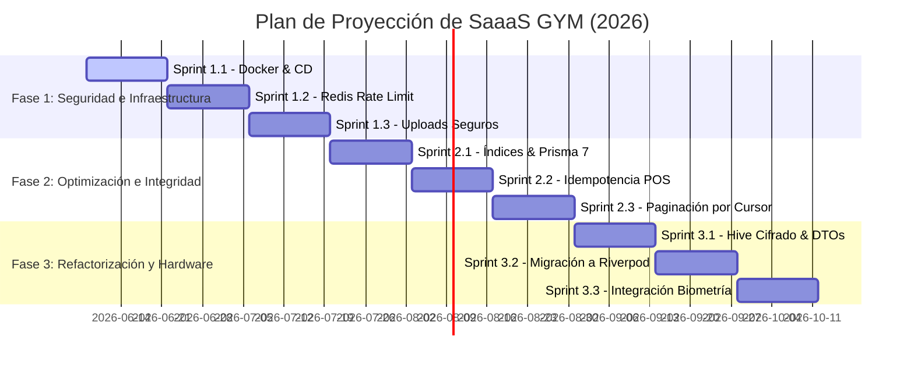

# 🧠 Memoria de Avance y Proyección — SAS Gym

Este archivo funciona como la memoria a largo plazo del asistente de desarrollo. Está diseñado para persistir el contexto del proyecto, permitiendo la limpieza segura de la caché de la conversación y del entorno sin perder el registro de los avances, decisiones técnicas y la hoja de ruta planificada.

---

## 📋 1. Estado y Avance del Proyecto (Fase Actual)

El ecosistema **SAS Gym** (SaaS de gestión de gimnasios) está estructurado en tres componentes principales: **Backend (NestJS)**, **Web Admin (React/Vite)** y **App Móvil (Flutter)**. 

### 🔧 Backend (NestJS + Prisma + Redis + PostgreSQL)
*   **Multitenancy**: Aislamiento a nivel de base de datos usando `tenant_id` por fila.
*   **Autenticación y Seguridad**:
    *   `RolesGuard` y decorador `@Auth()` con bypass para superadministrador.
    *   `RateLimitingGuard` integrado con Redis para bloquear IPs tras 5 intentos fallidos durante 15 minutos en `/auth/login`.
    *   Validación binaria de firmas de archivos (*magic bytes*) mediante `FileValidatorService` (bloquea la subida de ejecutables disfrazados de imágenes o PDFs).
    *   Servicio de almacenamiento `S3StorageService` listo para conectarse con AWS S3 o Cloudflare R2 usando URLs pre-firmadas temporales.
*   **Rendimiento y Transacciones**:
    *   Mecanismo de idempotencia en pasarela de pagos y POS (`IdempotencyInterceptor` y cache de respuestas en Redis por 24 horas usando llaves UUID).
    *   Paginación basada en cursores (`cursor-based`) en listado de auditorías y miembros para evitar degradación de performance.
*   **Integración de Hardware (IoT)**:
    *   Gateway WebSockets (`SaasGateway` con Socket.io) con endpoints para handshake de biometría y eventos de torniquetes físicos (`OPEN_GATE`).
    *   Validación con firmas SHA-256 en payloads biométricos.
    *   Registro de asistencias atómico mediante transacciones de Prisma.

### 📱 App Móvil (Flutter)
*   **Gestión de Estado**: Migración iniciada hacia **Riverpod** (desmantelando `GymState` en favor de `AuthProvider`, `RoutineProvider`, etc.).
*   **Persistencia Local**: Caché y base de datos local en SQLite/Hive cifrada con llaves AES-256 provenientes de `Flutter Secure Storage`.
*   **Desacoplamiento**: Separación de lógica de negocio y UI en `lib/models/domain` sin dependencias visuales de `material.dart`.
*   **Firmado**: Preparación de firmado seguro de releases fuera de Git con `key.properties`.

### 🎛️ Web Admin (React + Vite)
*   **Dockerización**: Contenedor productivo para servir el panel web estático.
*   **Módulos del Sistema**: CRM, gestión de gimnasios, clases grupales, membresías, productos/inventario, finanzas, dietas y entrenamientos, y sistema de puntos de fidelidad.

---

## 🌿 2. Estado Git Actual (Rama `production`)

La rama activa de trabajo es `production`. Actualmente, hay una gran cantidad de cambios sin confirmar (*uncommitted changes*) que consolidan la fase de desarrollo y optimización de las vistas y seguridad en los tres submódulos:

*   **Backend**: Modificaciones en interceptores (idempotencia y auditoría), guards (roles, rate limit y tenant), servicios de persistencia (s3, redis, fingerprint), y controladores de dieta/pagos/miembros.
*   **Mobile App**: Modificaciones y optimizaciones de UI en las vistas de administrador (auditoría, aprobaciones de pago, dashboard), cajero (POS, ventas, membresías, diálogos), y miembro (perfil, suscripciones, rutinas, dietas, etc.), además de pruebas unitarias/smoke.
*   **Web Admin**: Actualizaciones completas en las vistas de características principales (`CRM.jsx`, `Dietas.jsx`, `Finanzas.jsx`, `Productos.jsx`, `Asistencia.jsx`, `Entrenamientos.jsx`, etc.) para dar soporte a multitenancy y modularidad.

---

## 🗺️ 3. Plan de Proyección y Roadmap (Sprints)

El plan técnico estructurado en sprints de 2 semanas es el siguiente:



### Hitos Clave:
1.  **Fase 1: Infraestructura y Docker de Producción** (Sprints 1.1 al 1.3)
    *   Limitar recursos de hardware en Docker Compose (RAM limits en V8).
    *   Rate limiting centralizado en Redis.
    *   Uploads seguros en S3 con validación binaria estricta.
2.  **Fase 2: Optimización de Base de Datos** (Sprints 2.1 al 2.3)
    *   Índices compuestos B-Tree en PostgreSQL para búsquedas por `tenant_id`.
    *   Migración a Prisma 7.
    *   Garantizar idempotencia financiera de punta a punta.
3.  **Fase 3: Refactorización Flutter y WebSocket IoT** (Sprints 3.1 al 3.3)
    *   Riverpod + Hive Cifrado AES-256.
    *   Handshake de torniquetes por WebSocket con firmas seguras SHA-256.

---

## 🧹 4. Guía y Comandos para Limpiar Cachés (*Cache-Busting*)

Para forzar la reconstrucción total de los entornos y eliminar cualquier caché residual en desarrollo o producción local, ejecute los siguientes comandos en PowerShell/Bash dentro de sus respectivos directorios:

### A. Backend (NodeJS + NestJS)
*   **Limpiar dependencias y compilación**:
    ```bash
    # En el directorio backend/
    rm -rf dist/
    rm -rf tsconfig.tsbuildinfo
    npm cache clean --force
    ```
*   **Regenerar cliente de Prisma**:
    ```bash
    npx prisma generate
    ```

### B. Aplicación Móvil (Flutter)
*   **Limpiar caché de compilación y dependencias Dart**:
    ```bash
    # En el directorio mobile_app/
    flutter clean
    flutter pub cache clean
    flutter pub get
    ```

### C. Panel de Administración Web (React + Vite)
*   **Limpiar caché de Vite y empaquetado**:
    ```bash
    # En el directorio web_admin/
    rm -rf dist/
    rm -rf node_modules/.vite
    ```

### D. Redis (Contenedor Docker)
*   **Limpiar toda la caché en memoria de Redis**:
    ```bash
    # Si Redis se ejecuta en contenedor Docker
    docker compose exec redis redis-cli FLUSHALL
    ```

### E. Docker y Volúmenes (Limpieza Segura)
> [!IMPORTANT]  
> Según las reglas críticas de `AGENTS.md`, **NO** debe utilizar `docker system prune` ya que puede comprometer datos persistidos o volumenes de otros desarrollos del sistema.

*   **Comandos seguros de limpieza de contenedores**:
    ```bash
    # Detener servicios y eliminar contenedores/redes huérfanas
    docker compose down --remove-orphans
    
    # Limpiar caché de compilación específica de Docker (Buildkit)
    docker builder prune -f
    ```

---

## 🚀 5. Comandos de Validación Integral

Para ejecutar la suite completa de smoke-tests y verificar la integridad antes de cualquier despliegue o sincronización, corra:

```powershell
cd d:\proyectos\sas_gym
node scripts\full-verification.mjs
```

Para omitir módulos específicos durante el ciclo rápido de comprobaciones:
```powershell
node scripts\full-verification.mjs --skip-flutter --skip-docker
```
