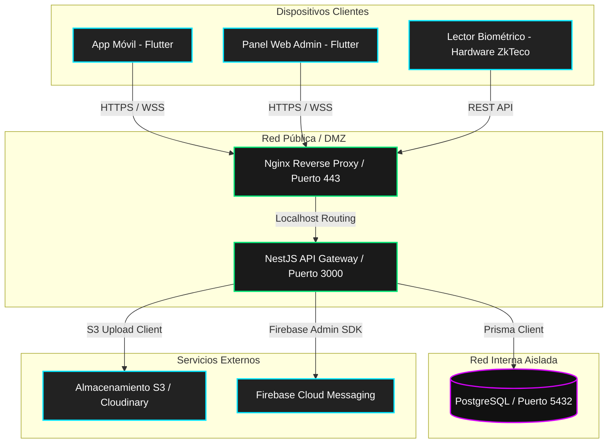

# Arquitectura Completa del Servidor (NestJS API) — GymSmart

Este documento describe la arquitectura técnica, el diseño del modelo de datos y las estrategias de seguridad, aislamiento y automatización implementadas en el servidor backend de **GymSmart** (la evolución mejorada de la plataforma CrossHero).

---

## 1. Stack Tecnológico Principal

El servidor está desarrollado bajo una arquitectura moderna de Node.js orientada a microservicios/módulos acoplados de forma limpia:

- **Framework**: [NestJS](https://nestjs.com/) (TypeScript) — Estructura progresiva y altamente escalable.
- **ORM**: [Prisma ORM](https://www.prisma.io/) — Cliente de base de datos de tipado fuerte.
- **Base de Datos**: [PostgreSQL](https://www.postgresql.org/) — Motor relacional robusto.
- **Servicio de Tiempo Real**: WebSockets mediante Socket.io (`@nestjs/websockets`).
- **Proveedor de Notificaciones**: Firebase Cloud Messaging (FCM) mediante Firebase Admin SDK.
- **Contenedores**: Docker & Docker Compose para empaquetado y aislamiento de servicios.

---

## 2. Diagrama de Capas y Aislamiento de Red

El servidor backend está diseñado para operar de forma segura detrás de un proxy inverso, con aislamiento estricto de la base de datos:



---

## 3. Estrategia Multi-tenant (Aislamiento de Datos)

GymSmart opera bajo el esquema de **SaaS Multi-tenant lógico (Single Database, Shared Schema)**. Todos los datos de las distintas organizaciones (gimnasios) coexisten en la misma base de datos relacional, pero se aíslan estrictamente mediante una llave de particionamiento lógico (`tenant_id`).

### Mecanismos de Aislamiento
1. **Particionamiento**: Toda tabla que contenga información operativa o de configuración del gimnasio incluye la columna `tenant_id`.
2. **Extracción y Validación de Contexto**:
   - Cada solicitud HTTP entrante debe incluir un token JWT en el header `Authorization` y el identificador del inquilino en el header `X-Tenant-ID`.
   - El [AuthGuard](file:///d:/proyectos/sas_gym/backend/src/core/guards/auth.guard.ts) intercepta la petición, valida la firma del JWT y extrae los metadatos del usuario (`user_id`, `email`, `rol`, `tenantId`).
   - El [TenantGuard](file:///d:/proyectos/sas_gym/backend/src/core/guards/tenant.guard.ts) verifica que el `tenant_id` enviado en el header coincida exactamente con el `tenantId` codificado en el payload del JWT del usuario. Esto previene que un usuario altere el header para acceder a los datos de otro gimnasio.
3. **Control de Acceso a Base de Datos**:
   - Los servicios del backend consumen el `tenant_id` inyectado a través del request context (usando el decorador `@TenantId()`) y lo aplican en la cláusula `where` de todas las consultas de Prisma.
   - Ejemplo conceptual:
     ```typescript
     this.prisma.membership.findMany({
       where: { tenant_id: tenantId }
     });
     ```

---

## 4. Estructura de Módulos del Servidor

La lógica de negocio de la aplicación está dividida de forma modular bajo los principios de NestJS:

```
backend/src/modules/
├── tenants/         # Registro de gimnasios, planes SaaS y suspensiones de servicio
├── auth/            # Gestión de credenciales, JWT, refresco y hashing (bcrypt)
├── members/         # Gestión de usuarios, perfiles segmentados (Operativo, Técnico, etc.)
├── payments/        # POS de ventas de productos, control de turnos de caja y aprobación de Yape/Plin
├── attendance/      # Registro de ingresos de socios, verificación de QR (TOTP) y biometría
├── schedules/       # Gestión de clases grupales, calendarios y reservaciones
├── routines/        # Biblioteca de ejercicios con loops GIF/WebM y agenda de entrenamientos 1:1
├── observations/    # Reportes de fallos en infraestructura con imágenes comprimidas
├── announcements/   # Feed de anuncios del gimnasio y envío masivo de notificaciones push
└── reports/         # Consultas analíticas complejas de ingresos, asistencia y retención
```

---

## 5. Características Técnicas y Flujos Avanzados

### 5.1 Control de Acceso por QR Dinámico (Criptografía TOTP)
Para erradicar el fraude de compartir capturas de pantalla de los códigos QR:
1. El backend genera y almacena una semilla TOTP única (`qr_secret`) para cada socio al momento de su registro.
2. La app móvil del socio lee la semilla y genera localmente un código numérico de 6 dígitos que cambia automáticamente cada 30 segundos (TOTP).
3. Al escanear el QR, el backend recibe el DNI y el código TOTP generado.
4. El [AttendanceService](file:///d:/proyectos/sas_gym/backend/src/modules/attendance/attendance.service.ts) valida el código contra la semilla utilizando una ventana de desfase de ±1 paso (tolerancia de 90 segundos para mitigar problemas de desincronización horaria del cliente).
5. Si el código es válido y la membresía del socio está `ACTIVE` o en periodo de gracia (`GRACE`), se le otorga acceso (`GREEN`). De lo contrario, se deniega (`RED`).

### 5.2 POS Integrado y Control de Turnos de Caja
A diferencia del CrossHero básico, GymSmart integra un módulo de caja diario para el personal de recepción (`CAJA`):
- **Turnos de Caja**: El backend controla la apertura y cierre de la caja (`Caja`), calculando el monto teórico esperado en efectivo, yape, plin y tarjeta POS frente al monto reportado físicamente al cerrar el turno.
- **Validación Horaria**: Los endpoints de cobro POS validan que la solicitud se realice dentro de la ventana del turno activo asignada al cajero (ej. 06:00 AM - 02:00 PM). Si se intenta procesar una transacción fuera de este horario, el servidor bloquea la acción.
- **Idempotencia (Venta Token)**: El backend utiliza un `venta_token` único por pago para evitar cobros dobles si el dispositivo móvil experimenta caídas de red y reintenta la petición HTTP.

### 5.3 Auditoría Automatizada Transparente
Para cumplir con las normas de seguridad SaaS frente a anulaciones de venta y bajas lógicas de socios, se implementa el [AuditInterceptor](file:///d:/proyectos/sas_gym/backend/src/core/interceptors/audit.interceptor.ts):
- Intercepta automáticamente cualquier petición HTTP de escritura exitosa (`POST`, `PATCH`, `DELETE`, `PUT`).
- Extrae la información del actor (usuario, rol, tenant).
- **Sanitización Profunda**: Limpia de manera recursiva cualquier campo sensible en el cuerpo de la petición (como `password`, `secret`, `token`, `hash`, `key`) reemplazándolos con `********`.
- Registra la transacción en la tabla `AuditLog` detallando el tipo de acción y los metadatos afectados.

### 5.4 WebSocket Gateway y Notificaciones Reactivas
El gateway [SaasGateway](file:///d:/proyectos/sas_gym/backend/src/core/gateways/saas.gateway.ts) expone un canal bidireccional en tiempo real:
- Exige autenticación por token en la conexión inicial.
- Agrupa dinámicamente a los clientes activos dentro de salas virtuales correspondientes a su `tenant_id`.
- Permite emitir eventos en tiempo real a todos los terminales de un gimnasio específico. Por ejemplo, al suspender un tenant por falta de pago del SaaS, el backend emite `tenant_suspended` y todas las apps de ese inquilino se bloquean en pantalla de forma instantánea.

### 5.5 Integración de Asistencia Biométrica
Soporte para terminales físicas lectoras de huellas (ZkTeco):
- **Modelado**: El modelo `Fingerprint` almacena las plantillas biométricas codificadas en Base64 junto con un hash SHA-256 para verificar su integridad.
- **Registro de Ingresos**: El endpoint recibe las plantillas enviadas por el lector en red y el backend busca el socio correspondiente en la base de datos, insertando el log en `FingerprintAttendance`.

---

## 6. Modelo de Datos Extendidos (Esquema Prisma)

La base de datos PostgreSQL, mapeada por Prisma ORM, está estructurada en cinco grandes dominios:

1. **Multi-Tenant & Usuarios**: `Tenant`, `User`, `TrainerProfile`, `MemberProfile`, `AuditLog`.
2. **Finanzas & Membresías**: `Membership`, `Payment`, `Caja`, `MovimientoCaja`.
3. **Control de Acceso**: `Attendance`, `Fingerprint`, `FingerprintAttendance`.
4. **Programación & Entrenamiento**: `Schedule`, `Booking`, `Exercise`, `RoutineTemplate`, `RoutineExercise`, `RoutineAssignment`, `WorkoutSession`, `SeriesLog`.
5. **Inventario & Puntos**: `ProductCategory`, `Product`, `ProductSale`, `ProductSaleDetail`, `ProductPaymentMethodDetail`, `InventoryMovement`, `PointsConfig`, `PointsBalance`, `PointsProduct`, `PointsMembership`, `PointsExchange`, `PointsMovement`.

---

## 7. Despliegue e Infraestructura Local

El entorno se levanta con Docker Compose mediante dos perfiles principales:

1. **Base de Datos y API**:
   - PostgreSQL corre aislado en una red interna (`internal-net`) inaccesible desde el exterior del host, enlazada únicamente al puerto `127.0.0.1:5432`.
   - La API de NestJS sirve de nexo entre la red interna y la red pública (`public-net`), exponiendo el puerto `3000` para los clientes HTTP/WS.
2. **Frontend y Prototipos**:
   - La aplicación móvil compilada para web corre en el puerto `8383`.
   - El Nginx estático del Hub de prototipos sirve la navegación unificada en el puerto `8282`.
