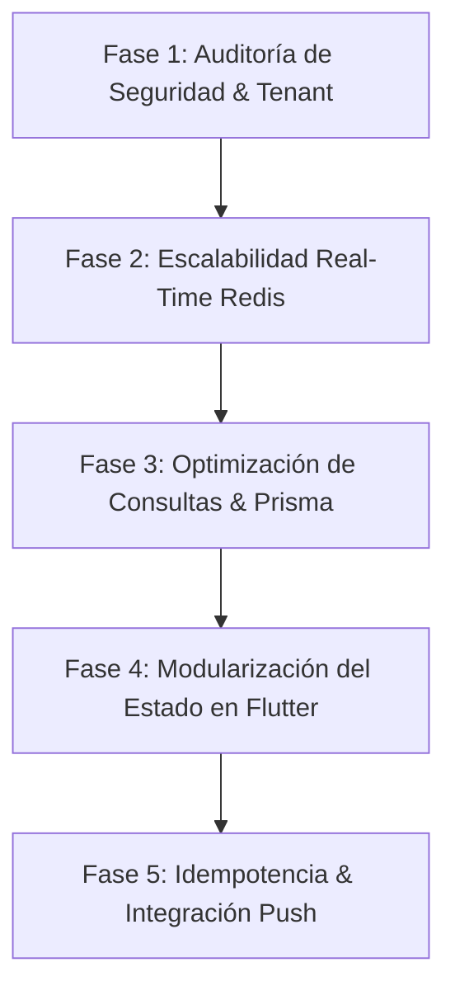

# Plan de Mejora Continua y Revisión Arquitectónica — GymSmart

Este plan establece una hoja de ruta técnica detallada para auditar, optimizar y escalar los componentes clave del servidor NestJS (API REST y WebSocket) y la aplicación móvil Flutter.

---

## 🗺️ Mapa de Ruta del Plan

---

## 1. Seguridad y Aislamiento Multi-Tenant

Actualmente, el aislamiento lógico se realiza a nivel de consulta Prisma mediante filtros explícitos `where: { tenant_id }`. Para mitigar el riesgo de fuga de datos debido a un error humano u omisión en futuras llamadas API:

### Acciones de Mejora
1. **Interceptores de Consulta Prisma (Middleware)**:
   - Implementar una extensión de Prisma (Prisma Client Extension) que intercepte todas las consultas de lectura y escritura de forma centralizada.
   - Inyectar de manera automática la restricción `tenant_id` en el objeto query en base al contexto transaccional, eliminando la necesidad de añadirlo manualmente en cada servicio NestJS.
2. **Auditoría de Sanitización Recursiva**:
   - Analizar el rendimiento de la sanitización profunda en el [AuditInterceptor](file:///d:/proyectos/sas_gym/backend/src/core/interceptors/audit.interceptor.ts) en peticiones con payloads de gran tamaño (ej: matrices de rutinas completas).
   - Implementar un caché de esquemas de datos o limitar la recursividad del interceptor a un máximo de 3 niveles para evitar el bloqueo del hilo principal de Node.js.

> [!WARNING]
> La omisión de filtros de tenant en consultas complejas (como joins relacionales implícitos) puede resultar en una brecha de privacidad entre inquilinos. Automatizar esta restricción a nivel de base de datos o middleware de ORM es de prioridad crítica.

---

## 2. Escalabilidad Real-Time y WebSockets

El servidor expone salas en tiempo real agrupadas por `tenant_id`. Sin embargo, en un despliegue horizontal multiservidor, las conexiones de socket.io quedarían aisladas en cada servidor individual.

### Acciones de Mejora
1. **Adaptador Redis para WebSockets**:
   - Migrar la gestión en memoria de Socket.io en [SaasGateway](file:///d:/proyectos/sas_gym/backend/src/core/gateways/saas.gateway.ts) al adaptador de Redis (`@socket.io/redis-adapter`).
   - Esto permite que los mensajes en tiempo real se publiquen en canales pub/sub de Redis, permitiendo que múltiples instancias de NestJS emitan eventos y compartan estados de sala concurrentemente.
2. **Reconexión Móvil Eficiente**:
   - La app Flutter debe implementar una estrategia de retroceso exponencial (*Exponential Backoff*) al reintentar conexiones de Socket.io en zonas de baja cobertura, evitando sobrecargar el backend con ráfagas de reconexiones.

---

## 3. Optimización de Consultas e Índices de Base de Datos

Conforme crezca el volumen de registros en tablas transaccionales como `SeriesLog`, `Attendance` y `Payment`, el tiempo de consulta se degradará debido a búsquedas secuenciales.

### Acciones de Mejora
1. **Índices Compuestos de Particionamiento**:
   - Crear índices compuestos B-Tree en PostgreSQL combinando la clave de inquilino con los campos de búsqueda comunes.
   - Específicamente en [schema.prisma](file:///d:/proyectos/sas_gym/backend/prisma/schema.prisma):
     - `Announcement`: Indexar `[tenant_id, activo]` para agilizar la carga del feed en el inicio del socio.
     - `Membership`: Indexar `[tenant_id, user_id, estado]` para acelerar la verificación del TOTP en los accesos.
     - `Attendance`: Indexar `[tenant_id, created_at]` para la generación rápida de reportes diarios de aforo.
2. **Pool de Conexiones Prisma**:
   - Ajustar el parámetro `connection_limit` en la URL de conexión del contenedor PostgreSQL de producción para evitar la saturación de memoria por hilos inactivos de bases de datos.

| Tabla | Índice Compuesto Propuesto | Propósito |
| :--- | :--- | :--- |
| `Announcement` | `@@index([tenant_id, activo])` | Carga ultrarrápida del feed de banners en la app. |
| `Membership` | `@@index([tenant_id, user_id, estado])` | Optimización del escaneo QR TOTP en la recepción. |
| `Payment` | `@@index([tenant_id, created_at])` | Reportes financieros del POS en tiempo real. |

---

## 4. Gestión de Estado Modular en Flutter (Refactorización)

Actualmente, [gym_state.dart](file:///d:/proyectos/sas_gym/mobile_app/lib/data/gym_state.dart) es un ChangeNotifier global masivo que administra sesión, catálogos, bitácoras, conectividad y WebSockets. Esto incrementa la probabilidad de rebujos (*rebuilds*) innecesarios en la interfaz.

### Acciones de Mejora
1. **Migración a Riverpod o BLoC**:
   - Fragmentar la lógica en controladores especializados orientados a dominios:
     - `authProvider`: Maneja inicio de sesión, renovación de token y sesión de usuario.
     - `memberProvider`: Maneja rutinas, check-ins y observaciones.
     - `cashierProvider`: Maneja sesiones de caja, ventas de productos e inventario.
     - `announcementsProvider`: Controla las notificaciones locales y banners dinámicos.
2. **Optimización con Selector**:
   - Utilizar el patrón `.select()` o Consumers específicos para suscribir la UI únicamente a los trozos específicos de información requerida, minimizando repintados innecesarios y caídas de frames en el renderizado móvil.

---

## 5. Idempotencia y Notificaciones Push (FCM)

El POS en caja puede sufrir cortes de red temporales, causando que el cajero pulse el botón de cobro repetidamente y genere transacciones duplicadas en la base de datos.

### Acciones de Mejora
1. **Llave de Idempotencia Estricta**:
   - Extender el POS para generar un hash criptográfico único por sesión de cobro en el cliente.
   - Validar este token en NestJS mediante Redis (con un tiempo de expiración de 5 minutos) antes de confirmar cualquier venta de membresía o producto.
2. **Integración Sincronizada con Google FCM**:
   - Enlazar la publicación de anuncios del backend con el envío de notificaciones push de Firebase en tiempo real.
   - Cuando se crea un anuncio con severidad `DANGER`, el backend debe disparar simultáneamente un *data payload push* para que los dispositivos móviles actualicen la interfaz en segundo plano.
