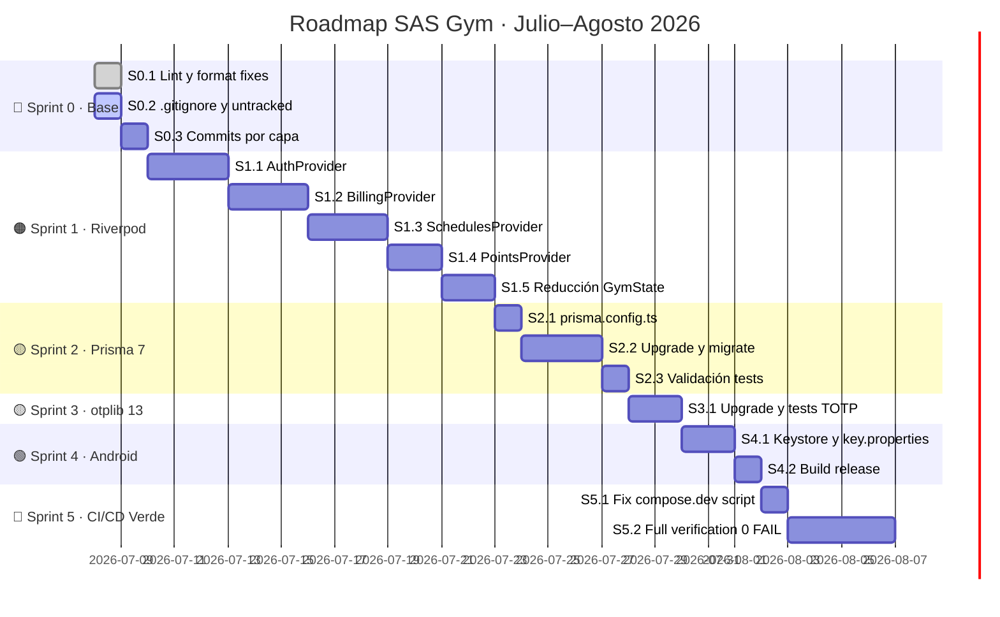

# 📋 Plan Detallado de Implementación — SAS Gym
**Creado:** 2026-07-08 | **Rama base:** `production`

---

## 🗺️ Mapa de Hitos



---

## 🔴 SPRINT 0 — Consolidación de Base
**Duración:** 1-2 días | **Prerrequisito de todo lo demás**  
**Meta:** Repositorio limpio, lint verde, commits organizados

---

### 📌 Hito 0.1 — Fix Lint y Format ✅ COMPLETADO
**Tiempo estimado:** 45 minutos

#### Tarea 0.1.1 — Corregir CRLF/LF en backend (prettier)
```powershell
cd d:\proyectos\sas_gym\backend
npx prettier --write "src/**/*.ts" "test/**/*.ts"
npm run lint   # debe terminar con 0 errores y 0 warnings
```
**Archivos afectados principales:**
- `src/app.controller.ts`
- `src/app.controller.spec.ts`
- (otros archivos modificados por prettier automáticamente)

#### Tarea 0.1.2 — Corregir formato Dart (dart formatter)
```powershell
cd d:\proyectos\sas_gym\mobile_app
dart format lib/ test/
dart format --output=none --set-exit-if-changed lib test  # debe salir 0
```

#### Tarea 0.1.3 — Corregir 4 warnings `use_build_context_synchronously`
**Archivo:** `mobile_app/lib/features/member/widgets/member_profile_page.dart`  
**Líneas:** 594, 598, 620, 621

Patrón a aplicar en cada caso:
```dart
// ANTES (incorrecto):
await algunaOperacion();
ScaffoldMessenger.of(context).showSnackBar(...); // uso de context post-await

// DESPUÉS (correcto):
await algunaOperacion();
if (!mounted) return;  // ← agregar este guard
ScaffoldMessenger.of(context).showSnackBar(...);
```

```powershell
# Validar que queden 0 issues
cd d:\proyectos\sas_gym\mobile_app
flutter analyze  # debe salir: No issues found!
```

**✅ Commit Hito 0.1:**
```
fix(quality): lint CRLF→LF backend, dart format, mounted guards in member_profile_page
SHA: 8ae99fd (dart format) / 29a5ead (backend lint)
```

---

### 📌 Hito 0.2 — .gitignore y archivos no trackeados
**Tiempo estimado:** 45 minutos

#### Tarea 0.2.1 — Agregar exclusiones al .gitignore

Agregar al final del `.gitignore`:
```gitignore
# Archivos generados por herramientas de análisis
graphify-out/
graphs/
graph.html
graph.json

# Archivos temporales de desarrollo
backend/scratch/
help.txt
arch.txt

# Archivos de build no versionados
backend/tsconfig.tsbuildinfo
```

#### Tarea 0.2.2 — Stagear archivos legítimos no trackeados
```powershell
# Módulos nuevos del backend
git add backend/src/core/types/
git add backend/src/modules/crm/
git add backend/src/modules/finances/

# Documentación de arquitectura
git add auditoria-deuda-tecnica-2026-06-14.md
git add docs/migration/
git add "docs/revision-refactorizacion-monolitos-2026-06-14.md"
git add descarga-despliegue.md

# CI/CD
git add .github/workflows/architecture.yml

# Web Admin nuevo
git add web_admin/eslint.config.js
git add web_admin/package.json
git add web_admin/package-lock.json
git add web_admin/src/main.jsx
git add web_admin/vite.config.js

# Agentes y memoria
git add .agents/

# Backend node version
git add backend/.node-version

# Decidir por separado (revisar contenido antes de commitear):
# backend/public/           → ¿assets estáticos del backend?
# backend/prisma/dump-data.ts → ¿seed real o temporal?
# backend/stress-test.js   → ¿herramienta útil o temporal?
# landing/                 → ¿proyecto independiente?
```

**✅ Commit Hito 0.2:**
```
chore(git): update .gitignore, add untracked modules (crm, finances, types, docs, CI)
```

---

### 📌 Hito 0.3 — Commits organizados por capa
**Tiempo estimado:** 30 minutos

```powershell
cd d:\proyectos\sas_gym

# ── Commit 1: Backend core ──────────────────────────────────────────────
git add backend/
git commit -m "feat(backend): rate-limiting Redis guard, idempotency interceptor, cursor pagination, S3 storage, magic-bytes validator, biometric IoT gateway"

# ── Commit 2: Mobile App ────────────────────────────────────────────────
git add mobile_app/
git commit -m "feat(mobile): admin/cashier/member UI views, encrypted Hive AES-256, websocket service, Riverpod diet+routine providers, smoke tests"

# ── Commit 3: Web Admin ─────────────────────────────────────────────────
git add web_admin/
git commit -m "feat(web-admin): full modular views multitenancy-ready — CRM, Finanzas, Productos, Dietas, Asistencia, Entrenamientos, Puntos, Membresias, Pagos"

# ── Commit 4: Infraestructura ───────────────────────────────────────────
git add infra/ docker-compose.yml docker-compose.dev.yml docker-compose.prod.yml
git commit -m "chore(infra): multi-env Docker compose segregation, resource limits, prod network config"

# ── Commit 5: Prisma schema ─────────────────────────────────────────────
git add backend/prisma/
git commit -m "chore(prisma): schema refinements — MembershipFreeze model, tenant_id in Fingerprint/ProductSale/InventoryMovement, ProductEstado enums"

# ── Commit 6: CI/CD workflows ───────────────────────────────────────────
git add .github/
git commit -m "chore(ci): update backend, flutter, integration and web-smoke GitHub Actions workflows"
```

**🏁 Verificar estado Git al cerrar Sprint 0:**
```powershell
git log --oneline -10
git status  # debe mostrar únicamente archivos pendientes de decisión
```

---

## 🟠 SPRINT 1 — Migración GymState → Riverpod
**Duración:** 2 semanas | **El más complejo y crítico**  
**Meta:** Reducir `gym_state.dart` de 102KB → <30KB, extraer 4 providers

---

### 📌 Hito 1.1 — AuthProvider
**Tiempo estimado:** 3 días

#### Tarea 1.1.1 — Crear `auth_provider.dart`
**Archivo:** `mobile_app/lib/providers/auth_provider.dart`

```dart
import 'package:flutter_riverpod/flutter_riverpod.dart';
import 'package:flutter_secure_storage/flutter_secure_storage.dart';

// State inmutable
class AuthState {
  final String? token;
  final String? refreshToken;
  final String? role;           // ADMIN | CASHIER | MEMBER | TRAINER | SUPERADMIN
  final String? tenantId;
  final bool isAuthenticated;
  final bool isLoading;
  final String? errorMessage;

  const AuthState({...});
  AuthState copyWith({...}) {...}
}

// Notifier
class AuthNotifier extends StateNotifier<AuthState> {
  AuthNotifier(this._storage, this._apiService) : super(const AuthState());

  final FlutterSecureStorage _storage;
  // ... login(), logout(), refreshSession(), restoreSession()
}

// Provider global
final authProvider = StateNotifierProvider<AuthNotifier, AuthState>((ref) => ...);
```

#### Tarea 1.1.2 — Extraer lógica de auth de `gym_state.dart`
Mover a `auth_provider.dart`:
- `login(email, password, tenantId)`
- `logout()`
- `refreshToken()`
- `restoreSession()` (desde Hive/SecureStorage)
- `currentUser`, `userRole`, `tenantId`

#### Tarea 1.1.3 — Actualizar pantallas que consumen auth
- `features/auth/` — login screen
- `main.dart` — bootstrap y routing por rol
- `features/admin/screens/admin_screen.dart`
- `features/cashier/screens/cashier_screen.dart`
- `features/member/screens/member_screen.dart`
- `features/trainer/screens/trainer_screen.dart`
- `features/superadmin/screens/superadmin_screen.dart`

```powershell
# Validar smoke tests de routing por rol
flutter test test/smoke/role_routing_test.dart
flutter test test/smoke/app_boot_test.dart
```

**✅ Commit Hito 1.1:**
```
feat(mobile/auth): extract AuthProvider from GymState — login, logout, session, role routing
```

---

### 📌 Hito 1.2 — BillingProvider
**Tiempo estimado:** 3 días

#### Tarea 1.2.1 — Crear `billing_provider.dart`
**Archivo:** `mobile_app/lib/providers/billing_provider.dart`

Estado a manejar:
- Membresía activa del socio actual
- Historial de pagos
- Comprobantes/recibos
- Estado del carrito POS (cajero)
- Métodos de pago disponibles

#### Tarea 1.2.2 — Actualizar vistas de billing
- `features/member/widgets/member_subscription_page.dart`
- `features/member/widgets/pay_membership_view.dart`
- `features/cashier/widgets/cashier_memberships_page.dart`
- `features/cashier/widgets/cashier_pos_page.dart`
- `features/cashier/widgets/cashier_sales_page.dart`
- `features/admin/widgets/admin_payment_approvals_page.dart`

```powershell
flutter test test/smoke/sync_queue_service_test.dart
```

**✅ Commit Hito 1.2:**
```
feat(mobile/billing): extract BillingProvider from GymState — memberships, POS, payments, receipts
```

---

### 📌 Hito 1.3 — SchedulesProvider
**Tiempo estimado:** 3 días

#### Tarea 1.3.1 — Crear `schedules_provider.dart`
**Archivo:** `mobile_app/lib/providers/schedules_provider.dart`

Estado a manejar:
- Listado de clases grupales disponibles
- Reservas activas del socio
- Capacidad y cupos disponibles
- Notificaciones de clase próxima

#### Tarea 1.3.2 — Actualizar vistas de schedules
- `features/member/widgets/notifications_view.dart`
- `features/admin/widgets/admin_ops_pages.dart`

**✅ Commit Hito 1.3:**
```
feat(mobile/schedules): extract SchedulesProvider from GymState — class bookings, slots, notifications
```

---

### 📌 Hito 1.4 — PointsProvider
**Tiempo estimado:** 2 días

#### Tarea 1.4.1 — Crear `points_provider.dart`
**Archivo:** `mobile_app/lib/providers/points_provider.dart`

Estado a manejar:
- Puntos acumulados del socio
- Historial de transacciones de puntos
- Beneficios disponibles para canjear

#### Tarea 1.4.2 — Actualizar vistas de puntos
- `features/member/widgets/member_home_page.dart` (badge de puntos)
- `features/member/widgets/member_profile_page.dart`

**✅ Commit Hito 1.4:**
```
feat(mobile/points): extract PointsProvider from GymState — loyalty points, history, redemption
```

---

### 📌 Hito 1.5 — Reducción y limpieza de GymState
**Tiempo estimado:** 2 días

#### Tarea 1.5.1 — Limpiar gym_state.dart
- Eliminar toda lógica ya migrada a los 4 providers
- Mantener solo lo que aún no se migró (si existe algo transitorio)
- Objetivo: archivo < 30KB (desde 102KB)

#### Tarea 1.5.2 — Limpiar gym_models.dart de dependencias UI
**Archivo:** `mobile_app/lib/models/gym_models.dart` (25KB)
- Remover imports de `material.dart`, `Color`, `IconData`, `Gradient`
- Garantizar DTOs puros testeables sin dependencias visuales

```powershell
# Suite completa de validación
flutter analyze   # 0 issues
flutter test      # todos pasan
flutter build apk --debug  # sin errores de compilación
```

**✅ Commit Hito 1.5:**
```
refactor(mobile): reduce GymState monolith — remove migrated logic, purify domain models
```

**🏁 Verificación Sprint 1:**
```powershell
flutter analyze         # 0 issues
flutter test            # todos pasan
(Get-Item mobile_app\lib\data\gym_state.dart).Length / 1KB  # < 30KB
```

---

## 🟡 SPRINT 2 — Migración Prisma 6 → 7
**Duración:** 5 días | **Requiere Docker Desktop corriendo**  
**Meta:** Backend corriendo sobre Prisma 7 con `prisma.config.ts`

---

### 📌 Hito 2.1 — Crear prisma.config.ts
**Tiempo estimado:** 1 día

#### Tarea 2.1.1 — Crear el archivo de configuración
**Archivo nuevo:** `backend/prisma.config.ts`

```typescript
import { defineConfig } from 'prisma/config'
import { loadEnvFile } from 'process'

// Prisma 7 ya no carga .env automáticamente — debe hacerse explícitamente
loadEnvFile('.env')

export default defineConfig({
  schema: 'prisma/schema.prisma',
})
```

#### Tarea 2.1.2 — Actualizar package.json del backend
```json
{
  "dependencies": {
    "@prisma/client": "^7.8.0"
  },
  "devDependencies": {
    "prisma": "^7.8.0"
  }
}
```

**✅ Commit Hito 2.1:**
```
chore(prisma): add prisma.config.ts for Prisma 7, bump prisma to ^7.8.0
```

---

### 📌 Hito 2.2 — Upgrade y validación de migraciones
**Tiempo estimado:** 3 días

#### Tarea 2.2.1 — Instalar Prisma 7 en el contenedor
```powershell
docker compose --env-file .env.local.example -f infra/docker/compose.local.yml up -d db redis
docker compose --env-file .env.local.example -f infra/docker/compose.local.yml run --rm api npm install
docker compose --env-file .env.local.example -f infra/docker/compose.local.yml run --rm api npx prisma validate
docker compose --env-file .env.local.example -f infra/docker/compose.local.yml run --rm api npx prisma generate
```

#### Tarea 2.2.2 — Correr migraciones existentes
```powershell
docker compose --env-file .env.local.example -f infra/docker/compose.local.yml run --rm api npx prisma migrate deploy
docker compose --env-file .env.local.example -f infra/docker/compose.local.yml run --rm api npx prisma db seed
```

#### Tarea 2.2.3 — Adaptar código si Prisma 7 cambió alguna API
Verificar breaking changes en:
- `backend/src/prisma/prisma.service.ts`
- Cualquier uso de `$queryRaw`, `$transaction`, tipos generados

**✅ Commit Hito 2.2:**
```
chore(prisma): upgrade to Prisma 7.x — migrate deploy validated, client regenerated
```

---

### 📌 Hito 2.3 — Validar tests con Prisma 7
**Tiempo estimado:** 1 día

```powershell
# Tests unitarios del backend
docker compose --env-file .env.local.example -f infra/docker/compose.local.yml exec api npx jest --runInBand

# Tests e2e
docker compose --env-file .env.local.example -f infra/docker/compose.local.yml exec api npm run test:e2e -- --runInBand
```

**🏁 Verificación Sprint 2:**
```powershell
docker compose exec api npx jest               # ✅ sin fallos
docker compose exec api npx prisma validate    # ✅ schema válido
```

---

## 🟡 SPRINT 3 — Upgrade otplib 12 → 13
**Duración:** 2 días  
**Meta:** TOTP/2FA funcionando con otplib 13, sin warnings de npm

---

### 📌 Hito 3.1 — Upgrade y certificación HMAC
**Tiempo estimado:** 2 días

#### Tarea 3.1.1 — Actualizar dependencia
```powershell
cd d:\proyectos\sas_gym\backend
# Editar package.json: "otplib": "^13.0.0"
npm install otplib@^13.0.0
```

#### Tarea 3.1.2 — Verificar compatibilidad de API
Revisar que el import y uso en `attendance.service.ts` sea compatible con otplib 13:

```typescript
// otplib 13.x — verificar que el import funciona igual
import { authenticator } from 'otplib';

// Verificar que generateSecret() y verify() funcionan
const secret = authenticator.generateSecret();
const token = authenticator.generate(secret);
const isValid = authenticator.verify({ token, secret });
```

#### Tarea 3.1.3 — Correr suite de asistencias
```powershell
docker compose exec api npx jest src/modules/attendance/ --runInBand --verbose
```

**✅ Commit Hito 3.1:**
```
chore(deps): upgrade otplib 12→13, certify TOTP HMAC compatibility in attendance service
```

---

## 🟢 SPRINT 4 — Firmado Android
**Duración:** 3 días  
**Meta:** APK/AAB release firmado y distribuible

---

### 📌 Hito 4.1 — Configurar Keystore y key.properties
**Tiempo estimado:** 2 días

#### Tarea 4.1.1 — Generar Keystore (fuera de Git)
```bash
keytool -genkey -v \
  -keystore ~/sasgym-release.keystore \
  -alias sasgym \
  -keyalg RSA \
  -keysize 2048 \
  -validity 10000
```

#### Tarea 4.1.2 — Crear key.properties (fuera del repo)
**Archivo:** `mobile_app/android/key.properties` (**agregar a .gitignore**)
```properties
storePassword=<password>
keyPassword=<password>
keyAlias=sasgym
storeFile=<ruta al .keystore>
```

#### Tarea 4.1.3 — Actualizar build.gradle para usar key.properties
**Archivo:** `mobile_app/android/app/build.gradle`
```groovy
def keystoreProperties = new Properties()
def keystorePropertiesFile = rootProject.file('key.properties')
if (keystorePropertiesFile.exists()) {
    keystoreProperties.load(new FileInputStream(keystorePropertiesFile))
}

android {
    signingConfigs {
        release {
            keyAlias keystoreProperties['keyAlias']
            keyPassword keystoreProperties['keyPassword']
            storeFile keystoreProperties['storeFile'] ? file(keystoreProperties['storeFile']) : null
            storePassword keystoreProperties['storePassword']
        }
    }
    buildTypes {
        release {
            signingConfig signingConfigs.release
        }
    }
}
```

#### Tarea 4.1.4 — Agregar key.properties al .gitignore
```gitignore
# Android signing (nunca versionar)
mobile_app/android/key.properties
*.keystore
*.jks
```

**✅ Commit Hito 4.1:**
```
chore(android): configure release signing via key.properties, update .gitignore
```

---

### 📌 Hito 4.2 — Build release validado
**Tiempo estimado:** 1 día

```powershell
cd d:\proyectos\sas_gym\mobile_app

# APK release
flutter build apk --release

# Android App Bundle (para Play Store)
flutter build appbundle --release
```

**✅ Commit Hito 4.2:**
```
chore(android): release build validated — APK and AAB signed successfully
```

---

## 🏁 SPRINT 5 — CI/CD Verde al 100%
**Duración:** 7 días  
**Meta:** `full-verification.mjs` con **0 FAIL** con Docker corriendo

---

### 📌 Hito 5.1 — Fix script de verificación
**Tiempo estimado:** 1 día

#### Tarea 5.1.1 — Corregir invocación de docker-compose.dev.yml
**Archivo:** `scripts/full-verification.mjs`

El script actualmente invoca:
```bash
# ❌ Incorrecto — .dev.yml es un override file, no puede usarse solo
docker compose -f docker-compose.dev.yml config
```

Debe ser:
```bash
# ✅ Correcto — siempre combinar con el compose base
docker compose -f docker-compose.yml -f docker-compose.dev.yml config
```

**✅ Commit Hito 5.1:**
```
fix(scripts): correct docker-compose.dev.yml invocation as override file in full-verification
```

---

### 📌 Hito 5.2 — Verificación completa 0 FAIL
**Tiempo estimado:** 4 días (iterativo)

#### Proceso iterativo:
```powershell
# 1. Correr verificación con Docker corriendo
cd d:\proyectos\sas_gym
node scripts/full-verification.mjs

# 2. Revisar summary
cat .artifacts\verification-<timestamp>\summary.md

# 3. Resolver cada FAIL encontrado
# 4. Repetir hasta 0 FAIL
```

**🏁 Verificación Final Sprint 5:**
```powershell
node scripts/full-verification.mjs
# Resultado esperado: todos los checks en ✅ OK
# Incluyendo: docker-up, migrate-deploy, test-e2e, security-http-suite, integration-smoke
```

**✅ Commit final del proyecto:**
```powershell
git add .
git commit -m "chore: full verification green — all checks passing, project ready for production clone"
git tag -a v1.0.0-ready -m "Proyecto listo para clonación en VPS productivo"
```

---

## 📊 Tablero de Seguimiento

| Sprint | Hito | Tarea | Estado | Commit |
|---|---|---|---|---|
| S0 | 0.1 | Fix lint backend | ✅ Completado | `29a5ead` |
| S0 | 0.1 | Fix dart format | ✅ Completado | `8ae99fd` |
| S0 | 0.1 | Fix mounted guards | ✅ Completado | `8ae99fd` |
| S0 | 0.2 | .gitignore updates | ⬜ Pendiente | `chore(git): update .gitignore...` |
| S0 | 0.3 | Commit backend | ✅ Completado | `68aec11` |
| S0 | 0.3 | Commit mobile | ⬜ Pendiente | `feat(mobile): admin/cashier...` |
| S0 | 0.3 | Commit web-admin | ✅ Completado | `2bc9a0d` |
| S0 | 0.3 | Commit infra | ⬜ Pendiente | `chore(infra): multi-env Docker...` |
| S1 | 1.1 | AuthProvider | ⬜ Pendiente | `feat(mobile/auth): extract...` |
| S1 | 1.2 | BillingProvider | ⬜ Pendiente | `feat(mobile/billing): extract...` |
| S1 | 1.3 | SchedulesProvider | ⬜ Pendiente | `feat(mobile/schedules): extract...` |
| S1 | 1.4 | PointsProvider | ⬜ Pendiente | `feat(mobile/points): extract...` |
| S1 | 1.5 | Reducción GymState | ⬜ Pendiente | `refactor(mobile): reduce GymState...` |
| S2 | 2.1 | prisma.config.ts | ⬜ Pendiente | `chore(prisma): add prisma.config.ts...` |
| S2 | 2.2 | Upgrade Prisma 7 | ⬜ Pendiente | `chore(prisma): upgrade to Prisma 7.x...` |
| S2 | 2.3 | Tests Prisma 7 | ⬜ Pendiente | (validación) |
| S3 | 3.1 | otplib 13 | ⬜ Pendiente | `chore(deps): upgrade otplib 12→13...` |
| S4 | 4.1 | Android Keystore | ⬜ Pendiente | `chore(android): configure release...` |
| S4 | 4.2 | Build release | ⬜ Pendiente | (validación) |
| S5 | 5.1 | Fix compose.dev | ⬜ Pendiente | `fix(scripts): correct compose...` |
| S5 | 5.2 | 0 FAIL final | ⬜ Pendiente | `chore: full verification green...` |

---

> [!NOTE]
> Este documento se actualizará conforme avancen los sprints. Marcar cada tarea con ✅ al completarse y registrar el SHA del commit correspondiente.

> [!IMPORTANT]
> El Sprint 0 es un prerequisito absoluto. Sin commits organizados y lint verde, los demás sprints generarán conflictos de merge difíciles de resolver.
