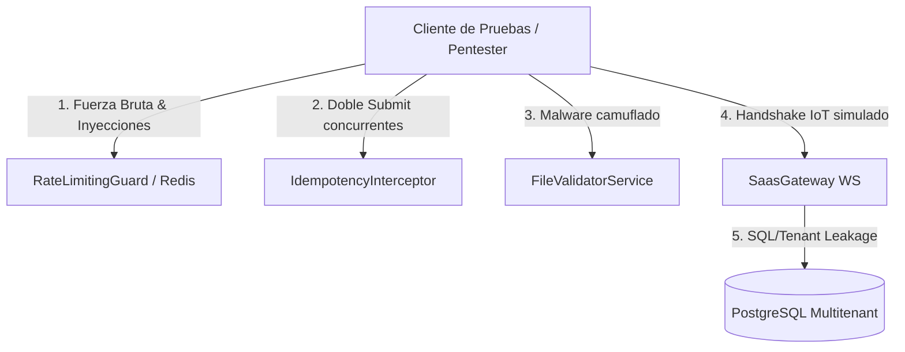

# 🛡️ Plan de Verificación Técnica y Auditoría de Seguridad — 2026-06-13
**Documento de Trabajo:** `plan-verificacion-auditoria-2026-06-13.md`  
**Estado:** Propuesto para revisión de ingeniería  
**Objetivo:** Establecer la bitácora y especificación de pruebas para auditar la robustez de los mecanismos de seguridad, redundancia, idempotencia y flujos IoT recientemente incorporados en el ecosistema **SaaaS GYM**.

---

## 🗺️ Alcance de la Auditoría

El plan de verificación cubre los componentes críticos de la infraestructura backend, la persistencia en caché y la comunicación de hardware IoT:



---

## 🔒 1. Auditoría de Seguridad y Control de Tasa (Rate Limiting)

### 🧪 Caso 1.1: Bloqueo de Fuerza Bruta en Autenticación
* **Propósito:** Validar que 5 intentos fallidos consecutivos de login bloqueen temporalmente tanto a la IP como al correo de usuario por 15 minutos en Redis.
* **Comandos de Simulación (Pentesting):**
  1. Ejecutar peticiones concurrentes rápidas desde el cliente de prueba (`gymsmart-test-client`):
     ```bash
     docker compose exec test-client sh -c "for i in 1 2 3 4 5 6; do curl -i -X POST -H 'Content-Type: application/json' -d '{\"email\":\"socio@test.com\",\"password\":\"clave_incorrecta\"}' http://api:3000/api/v1/auth/login; done"
     ```
  2. Verificar que los primeros 5 intentos devuelvan `401 Unauthorized` y el 6.º retorne `429 Too Many Requests`.
  3. Revisar la existencia de claves de bloqueo en Redis dentro del contenedor:
     ```bash
     docker compose exec redis redis-cli -a postgres_secure_password KEYS "rate:block:*"
     ```

### 🧪 Caso 1.2: Evasión de IP (Spoofing de Cabeceras HTTP)
* **Propósito:** Evitar que un atacante evada el bloqueo de IP modificando la cabecera `X-Forwarded-For`.
* **Acciones de Prueba:**
  1. Enviar 3 peticiones con `X-Forwarded-For: 203.0.113.19` y 3 con `X-Forwarded-For: 203.0.113.19, 192.168.1.1`.
  2. Confirmar que el Rate Limiting compute los fallos sobre la IP real del cliente origen (el primer elemento del proxy o la IP de conexión directa).

---

## 💳 2. Auditoría de Idempotencia y Concurrencia Financiera

### 🧪 Caso 2.1: Test de Doble Envío Simultáneo (Double-Submit)
* **Propósito:** Asegurar que dos solicitudes de cobro con la misma cabecera `Idempotency-Key` enviadas al mismo milisegundo no resulten en doble cobro o inserción duplicada en la base de datos.
* **Comandos de Simulación (Pentesting):**
  1. Generar una clave de idempotencia UUID.
  2. Enviar dos peticiones POST en paralelo usando `curl` con la misma clave:
     ```bash
     docker compose exec test-client sh -c "curl -i -X POST -H 'Idempotency-Key: a1b2c3d4-e5f6-7a8b-9c0d-1e2f3a4b5c6d' -H 'Content-Type: application/json' -d '{\"planId\":\"plan-gold\",\"monto\":150}' http://api:3000/api/v1/payments/me & curl -i -X POST -H 'Idempotency-Key: a1b2c3d4-e5f6-7a8b-9c0d-1e2f3a4b5c6d' -H 'Content-Type: application/json' -d '{\"planId\":\"plan-gold\",\"monto\":150}' http://api:3000/api/v1/payments/me"
     ```
  3. Verificar que una petición procese con `201 Created` y la otra sea rechazada inmediatamente con `409 Conflict` (petición en curso) o devuelva el resultado guardado de la primera si se resolvió antes de que expire el TTL.

### 🧪 Caso 2.2: Autoliberación de Clave tras Excepción
* **Propósito:** Verificar que si la transacción interna del backend falla (ej. error de base de datos), la clave de idempotencia se elimine de Redis permitiendo reintentar.

---

## 📂 3. Auditoría de Firmas Binarias y Evasión de Extensiones

### 🧪 Caso 3.1: Subida de Script Camuflado (Exploit de Imagen)
* **Propósito:** Validar que el servidor detecte archivos maliciosos PHP o Bash renombrados maliciosamente a `.png` o `.jpg`.
* **Acciones de Prueba:**
  1. Crear un archivo de texto con código PHP malicioso y guardarlo como `malware.png`:
     ```bash
     echo "<?php system(\$_GET['cmd']); ?>" > malware.png
     ```
  2. Intentar subir el archivo al endpoint de fotos de perfil.
  3. Confirmar que la API responda con `400 Bad Request` debido a la discrepancia en la firma binaria real (*magic bytes*).

### 🧪 Caso 3.2: Archivos Vacíos y PDF Corruptos
* **Propósito:** Probar la resistencia de `FileValidatorService` a buffers nulos o de tamaño inadecuado.

---

## 📱 4. Auditoría de Datos, Multi-Tenancy e Índices

### 🧪 Caso 4.1: Filtrado de Datos de Sedes Diferentes (Tenant Leakage)
* **Propósito:** Validar que ninguna consulta o query del panel de administración (incluso mediante ataques de inyección) devuelva datos pertenecientes a otra sede (tenant).
* **Acciones de Prueba:**
  1. Registrar datos de prueba en la base de datos correspondientes a dos Tenants: `Tenant-A` (Santiago) y `Tenant-B` (Lima).
  2. Ejecutar listados autenticados como administrador de `Tenant-A`.
  3. Comprobar que en la base de datos no se mezcle ningún DNI o ID de miembro de `Tenant-B`.

### 🧪 Caso 4.2: Evaluación de Rendimiento con Índices de Prisma
* **Propósito:** Validar la reducción en tiempos de consulta al utilizar paginación basada en cursor en listados de gran escala (ej. `AuditLog` y `FingerprintAttendance`).
* **Métrica de Aceptación:** Consultas con cursor deben mantener tiempos constantes ($O(1)$) en lugar del crecimiento lineal de latencia ($O(N)$) del offset clásico.

---

## 🎛️ 5. Auditoría de Canales WebSocket y Flujo IoT (Torniquetes)

### 🧪 Caso 5.1: Conexión de Sockets sin Autenticación
* **Propósito:** Verificar que el gateway de Sockets `SaasGateway` desconecte inmediatamente conexiones sin token JWT válido.
* **Acciones de Prueba:**
  1. Intentar abrir una conexión WS sin mandar token de autenticación.
  2. Confirmar que el servidor de Sockets devuelva el cierre de conexión instantáneo.

### 🧪 Caso 5.2: Simulación de Handshake Biométrico Exitoso
* **Propósito:** Simular que el lector ZkTeco envía una huella digital autorizada y el torniquete recibe la señal binaria `OPEN_GATE`.
* **Pasos:**
  1. Emitir evento `biometric-handshake` desde un cliente Socket mock.
  2. Verificar que se emita en tiempo real al panel del administrador de la sede el veredicto `GREEN` de ingreso.

---

## 📅 6. Cronograma y Bitácora de Auditoría (2026-06-13)

| Fase | Tarea de Verificación | Método | Responsable | Estado |
| :--- | :--- | :--- | :--- | :--- |
| **A-1** | Ejecución de tests automatizados de backend (`npx jest`) | Automatizado | QA / Dev | ✅ Pasado |
| **A-2** | Ejecución de tests automatizados de móvil (`flutter test`) | Automatizado | QA / Dev | ✅ Pasado |
| **A-3** | Simulación manual de concurrencia e inyección de Magic Bytes | Manual (Scripts) | Dev | 🔄 Pendiente |
| **A-4** | Revisión de logs en Redis ante ráfagas de Rate Limiting | Monitorización | SysAdmin | 🔄 Pendiente |
| **A-5** | Smoke tests en staging sobre contenedores producción | Integración | Dev | 🔄 Pendiente |
