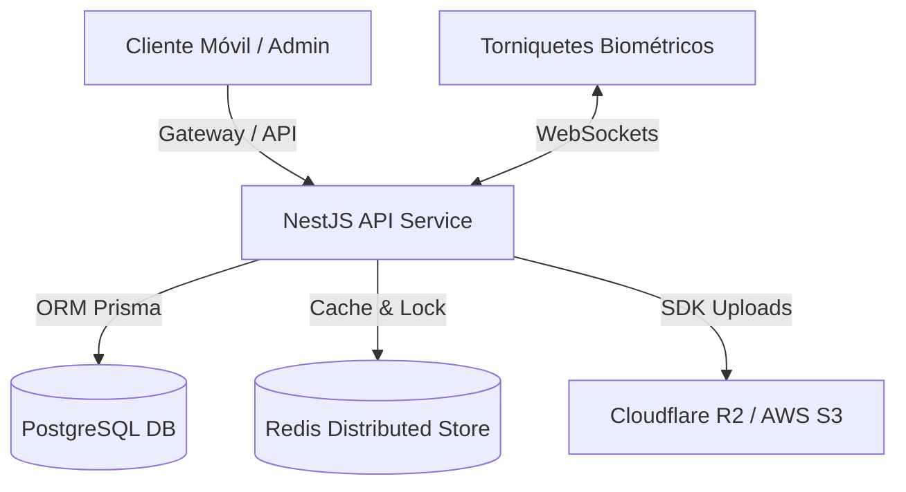

# Plan de Implementación de Arquitectura y Resolución de Deuda Técnica
**Fecha de Creación:** 2026-06-13
**Documento de Trabajo:** `implementacion-deuda-tecnica-2026-06-13.md`
**Estado:** Propuesto para revisión de ingeniería

Este documento detalla técnicamente los entregables, segmentos de código, esquemas de prueba y comandos de validación para resolver los pendientes del ecosistema **SaaaS GYM**.

---

## 🗺️ Estructura del Ecosistema de Datos



---

## 📂 Fase 1: Infraestructura Multi-Entorno y Normalización Prisma
**Objetivo:** Establecer una división estricta entre desarrollo y producción, optimizar el uso de memoria RAM del motor Node en producción y estructurar la base de datos de forma relacional y aislada.

### 🧩 Segmento 1.1: Manifiestos de Docker Compose
* **Entregable 1 (Dev):** `d:\proyectos\sas_gym\docker-compose.dev.yml`
  * Montajes en vivo (`volumes: - ./backend:/app`) para reflejar cambios en caliente.
  * Inyección automática del seed (`npx prisma db seed`).
* **Entregable 2 (Prod):** `d:\proyectos\sas_gym\docker-compose.prod.yml`
  * Desconexión total de carpetas locales (el código corre compilado dentro de la imagen).
  * Límite estricto de memoria RAM (`mem_limit: 1024m`) y CPU (`cpus: 1.0`).
  * Optimización de recolección de basura mediante variable de entorno: `NODE_OPTIONS=--max-old-space-size=768`.

### 🧩 Segmento 1.2: Refactorización de Esquema y Migración incremental
* **Entregable 3 (Schema):** `d:\proyectos\sas_gym\backend\prisma\schema.prisma`
  * Creación e integración de enums nativos:
    ```prisma
    enum ProductEstado {
      activo
      inactivo
      agotado
    }
    enum ProductSaleEstado {
      pendiente
      completada
      cancelada
    }
    ```
  * Tabla histórica de congelamientos para membresías:
    ```prisma
    model MembershipFreeze {
      id                 String     @id @default(uuid())
      membership_id      String
      membership         Membership @relation(fields: [membership_id], references: [id], onDelete: Cascade)
      fecha_congelacion  DateTime
      fecha_descongelacion DateTime?
      razon              String
      created_at         DateTime   @default(now())
      
      @@index([membership_id])
    }
    ```
  * Columnas de `tenant_id` y relaciones en: `Fingerprint`, `FingerprintAttendance`, `ProductPaymentMethodDetail`, `ProductSaleDetail`, `RefreshTokenSession` e `InventoryMovement`.

### 🧪 Verificación de Fase 1
1. Levantar contenedor de desarrollo:
   ```powershell
   docker compose -f docker-compose.dev.yml up -d --build
   ```
2. Generar migración SQL sin interactividad:
   ```powershell
   docker compose -f docker-compose.dev.yml exec -T api npx prisma migrate dev --name schema_refinements
   ```
3. Ejecutar seed y comprobar que no hay violaciones de clave foránea de Tenant:
   ```powershell
   docker compose -f docker-compose.dev.yml exec -T api npx prisma db seed
   ```

---

## 🔒 Fase 2: Control de Tasa (Rate Limiting) y Bloqueo de IPs
**Objetivo:** Proteger el servidor contra denegación de servicio (DoS) y ataques de fuerza bruta en inicio de sesión, manteniendo el estado de bloqueo compartido de manera distribuida.

### 🧩 Segmento 2.1: Adaptador de Redis
* **Entregable 4:** `d:\proyectos\sas_gym\backend\src\core\services\redis.service.ts`
  * Cliente Redis que exporta funciones atómicas para incrementos de contadores con TTL:
    ```typescript
    async incrWithTtl(key: string, ttlSeconds: number): Promise<number>;
    ```

### 🧩 Segmento 2.2: Guard de Seguridad Distribuido
* **Entregable 5:** `d:\proyectos\sas_gym\backend\src\core\guards\rate-limiting.guard.ts`
  * Intercepta la IP del cliente (`request.ip`) y el correo de intento de login.
  * Clave en Redis: `rate:login:ip:<client_ip>` y `rate:login:user:<email>`.
  * Límite: Bloquear por 15 minutos (retornando HTTP 429) tras 5 intentos fallidos consecutivos.

### 🧪 Verificación de Fase 2
1. Ejecutar pruebas unitarias locales del Guard simulando peticiones con Jest:
   ```powershell
   docker compose -f docker-compose.dev.yml exec -T api npx jest src/core/guards/rate-limiting.guard.spec.ts
   ```
2. Lanzar script de peticiones masivas rápidas y verificar respuesta 429:
   ```powershell
   docker compose -f docker-compose.dev.yml exec -T test-client sh -c "for i in 1 2 3 4 5 6; do curl -i -X POST -d '{\"email\":\"socio@test.com\",\"password\":\"bad\"}' http://api:3000/api/v1/auth/login; done"
   ```

---

## 💳 Fase 3: Idempotencia Financiera y Paginación por Cursor
**Objetivo:** Eliminar riesgos de doble cobro y optimizar consultas masivas de reportería de caja y socios.

### 🧩 Segmento 3.1: Interceptor de Idempotencia
* **Entregable 6:** `d:\proyectos\sas_gym\backend\src\core\interceptors\idempotency.interceptor.ts`
  * Intercepta peticiones POST que contengan la cabecera `Idempotency-Key`.
  * Valida en Redis si la llave `idem:<key>` existe:
    * Si existe y está en progreso: Retorna HTTP 409 (Conflict).
    * Si existe y está resuelta: Retorna directamente la respuesta en caché de la base de datos sin volver a ejecutar la lógica del controlador.
    * Si no existe: Procesa la petición y guarda el resultado en Redis con TTL de 24 horas.

### 🧩 Segmento 3.2: Paginación Avanzada por Cursor
* **Entregable 7:** `d:\proyectos\sas_gym\backend\src\modules\members\members.service.ts`
  * Refactorizar método `findAll` para admitir cursor:
    ```typescript
    async findAll(tenantId: string, limit: number, cursor?: string) {
      return this.prisma.user.findMany({
        take: limit,
        skip: cursor ? 1 : 0,
        cursor: cursor ? { id: cursor } : undefined,
        where: { tenant_id: tenantId, rol: Role.MEMBER },
        orderBy: { id: 'asc' },
      });
    }
    ```

### 🧪 Verificación de Fase 3
1. Ejecutar test e2e de concurrencia e idempotencia:
   ```powershell
   docker compose -f docker-compose.dev.yml exec -T api npx jest test/idempotency.e2e-spec.ts
   ```

---

## 📂 Fase 4: Validación de Firma Binaria y Migración S3
**Objetivo:** Prevenir la ejecución de scripts camuflados en imágenes de perfil o recibos subidos al servidor y retirar almacenamiento local en favor de almacenamiento en la nube.

### 🧩 Segmento 4.1: Validador de Firmas Binarias (Magic Bytes)
* **Entregable 8:** `d:\proyectos\sas_gym\backend\src\core\services\file-validator.service.ts`
  * Analiza el búfer del archivo subido en memoria para verificar los encabezados de firma:
    * **JPEG:** `FF D8 FF`
    * **PNG:** `89 50 4E 47 0D 0A 1A 0A`
    * **PDF:** `25 50 44 46`

### 🧩 Segmento 4.2: Cliente de Almacenamiento en Nube
* **Entregable 9:** `d:\proyectos\sas_gym\backend\src\core\services\s3-storage.service.ts`
  * Conexión con SDK AWS S3 o Cloudflare R2.
  * Método de subida atómico y método para recuperar URLs firmadas pre-autenticadas:
    ```typescript
    async getPresignedUrl(key: string, expirySeconds: number = 900): Promise<string>;
    ```

### 🧪 Verificación de Fase 4
1. Test de evasión de seguridad (intento de subir un archivo ejecutable renombrado a `.png`):
   ```powershell
   docker compose -f docker-compose.dev.yml exec -T api npx jest src/core/services/file-validator.service.spec.ts
   ```

---

## 📱 Fase 5: Refactorización Riverpod y Workspace iOS (App Móvil)
**Objetivo:** Dividir el estado de la app en proveedores desacoplados e inmutables, desvincular el dominio del motor visual de Flutter, y configurar el canal de compilación Apple Xcode.

### 🧩 Segmento 5.1: Riverpod e Inmutabilidad de Estado
* **Entregable 10:** `d:\proyectos\sas_gym\mobile_app\lib\providers\routine_provider.dart`
  * Implementa `StateNotifier` o clases auto-generadas (`@riverpod`) para sincronización reactiva e independiente de rutinas y ejercicios.

### 🧩 Segmento 5.2: Generación Workspace Nativo iOS
* **Entregable 11:** `d:\proyectos\sas_gym\mobile_app\ios\Podfile` e integraciones nativas Xcode.
  * Habilita soporte para Swift CocoaPods.
  * Inyección del archivo `key.properties` y variables de Keystore para firmas de Android fuera de Git.

### 🧪 Verificación de Fase 5
1. Correr los test unitarios nativos de Dart aislados de Widgets visuales:
   ```powershell
   docker compose -f docker-compose.dev.yml --profile ci run --rm flutter-ci flutter test test/domain
   ```
2. Ejecutar comando de compilación sintáctica en el simulador de iOS:
   ```bash
   cd mobile_app && flutter build ios --no-codesign --simulator
   ```

---

## 🎛️ Fase 6: Canales WebSocket y Control de Acceso IoT (Torniquetes)
**Objetivo:** Establecer la comunicación de telemetría y eventos de apertura reactiva en tiempo real con las compuertas de acceso físicas.

### 🧩 Segmento 6.1: Eventos de Gateway IoT
* **Entregable 12:** `d:\proyectos\sas_gym\backend\src\core\gateways\saas.gateway.ts`
  * Maneja los eventos en tiempo real:
    * `biometric-handshake`: Para recibir las lecturas de los torniquetes.
    * `OPEN_GATE`: Emisión de señal binaria con código de autorización hacia el hardware.

### 🧩 Segmento 6.2: DTO y Esquema de Validación de Lectura
* **Entregable 13:** `d:\proyectos\sas_gym\backend\src\modules\biometric\biometric-handshake.dto.ts`
  * Validación estricta del ID del dispositivo ZkTeco, hash biométrico, e integridad de integridad SHA-256.

### 🧪 Verificación de Fase 6
1. Ejecutar pruebas unitarias y de integración de la comunicación por sockets:
   ```powershell
   docker compose -f docker-compose.dev.yml exec -T api npx jest src/core/gateways/biometric-handshake.gateway.spec.ts
   ```
