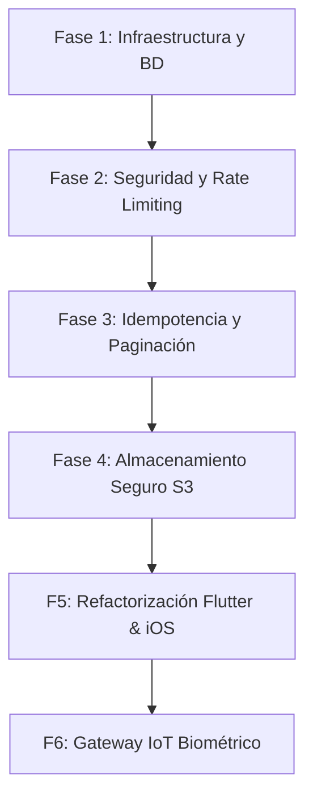

# Plan de Implementación Detallado por Fases Verificables — SaaaS GYM

Este documento establece la planificación segmentada por fases incrementales para la resolución total de la deuda técnica de **SaaaS GYM**. Cada fase cuenta con entregables claros, criterios de aceptación estrictos y métodos de verificación automatizados.

---

## 🗺️ Mapa de Fases de la Hoja de Ruta



---

## 📂 Fase 1: Infraestructura Multi-Entorno y Optimización de Base de Datos
**Objetivo:** Separar limpiamente los entornos de ejecución (Desarrollo vs. Producción) y erradicar las últimas inconsistencias de tipo en el esquema Prisma.

### 📦 Entregables
1. **[NEW] [docker-compose.dev.yml](file:///d:/proyectos/sas_gym/docker-compose.dev.yml):** Orquestación local con recarga en caliente (`watch`), volúmenes mapeados e inyección de datos de prueba automáticos.
2. **[NEW] [docker-compose.prod.yml](file:///d:/proyectos/sas_gym/docker-compose.prod.yml):** Configuración de producción sin mapeo de host, con restricciones físicas de CPU/RAM (`1024M` RAM, `1.0` cores), y variables de entorno V8 optimizadas (`NODE_OPTIONS=--max-old-space-size=768`).
3. **[MODIFY] [schema.prisma](file:///d:/proyectos/sas_gym/backend/prisma/schema.prisma):**
   * Migrar columnas de estado en `Product.estado` y `ProductSale.estado` a enums nativos (`ProductEstado` y `ProductSaleEstado`).
   * Modelar la tabla `MembershipFreeze` (`id`, `membership_id`, `fecha_inicio`, `fecha_fin`, `razon`) con relación de uno a muchos en lugar de campos planos en `Membership`.
   * Adicionar la columna `tenant_id` y su clave foránea en las tablas transaccionales restantes (`Fingerprint`, `FingerprintAttendance`, `ProductPaymentMethodDetail`, `ProductSaleDetail`, `RefreshTokenSession` e `InventoryMovement`) para búsquedas directas sin *JOINs* costosos.

### 🧪 Plan de Verificación (Tests)
* **Verificación de Estructura Multi-Entorno:**
  Levantar la infraestructura de desarrollo usando el manifiesto específico:
  ```powershell
  docker compose -f docker-compose.dev.yml up -d
  ```
* **Generación de Migración Incremental:**
  Ejecutar el comando de migraciones dentro del contenedor NestJS para validar la congruencia de los enums y las llaves foráneas directas de multitenant:
  ```powershell
  docker compose -f docker-compose.dev.yml exec api npx prisma migrate dev --name schema_refinements
  ```
* **Verificación de Seed de Datos:**
  Comprobar que el script de seed carga correctamente los datos de prueba simulando el historial de congelamientos múltiples y enums:
  ```powershell
  docker compose -f docker-compose.dev.yml exec api npx prisma db seed
  ```

---

## 🔒 Fase 2: Seguridad de Acceso y Rate Limiting Distribuido (Redis)
**Objetivo:** Proteger los endpoints críticos de autenticación y transacciones contra ataques de fuerza bruta y denegación de servicio utilizando un almacén de memoria distribuido.

### 📦 Entregables
1. **[MODIFY] [docker-compose.dev.yml](file:///d:/proyectos/sas_gym/docker-compose.dev.yml) y [docker-compose.prod.yml](file:///d:/proyectos/sas_gym/docker-compose.prod.yml):** Adición de la imagen y volumen de **Redis** (`redis:7-alpine`) en la red interna del clúster.
2. **[NEW] [redis.service.ts](file:///d:/proyectos/sas_gym/backend/src/core/services/redis.service.ts):** Módulo adaptador centralizado para comunicación mediante `ioredis`.
3. **[NEW] [rate-limiting.guard.ts](file:///d:/proyectos/sas_gym/backend/src/core/guards/rate-limiting.guard.ts):** Guard global que intercepta peticiones en `/auth/login` y endpoints transaccionales, aplicando bloqueo temporal de IP y usuario al alcanzar un umbral determinado (ej. 5 fallos en 15 minutos).

### 🧪 Plan de Verificación (Tests)
* **Prueba de Estrés / Bloqueo (Stress Script):**
  Lanzar un script rápido desde el cliente de prueba (`gymsmart-test-client`) que sature intencionalmente el login con credenciales erróneas y verificar que retorne código de estado HTTP `429 Too Many Requests`:
  ```powershell
  docker compose exec test-client curl -X POST -d "{\"email\":\"socio01@test.com\",\"password\":\"wrong\"}" http://api:3000/api/v1/auth/login
  ```
* **Prueba de Aislamiento en Pruebas Unitarias:**
  Crear y ejecutar tests unitarios para verificar la lógica de expiración de contadores de IP en el adaptador de Redis:
  ```powershell
  docker compose exec api npx jest src/core/guards/rate-limiting.guard.spec.ts
  ```

---

## 💳 Fase 3: Idempotencia Financiera y Paginación por Cursor
**Objetivo:** Evitar la duplicidad involuntaria de cobros en los módulos de venta y optimizar la recuperación de datos históricos en tablas masivas.

### 📦 Entregables
1. **[NEW] [idempotency.interceptor.ts](file:///d:/proyectos/sas_gym/backend/src/core/interceptors/idempotency.interceptor.ts):** Interceptor que verifica la presencia de la cabecera HTTP `Idempotency-Key` en peticiones de cobro (`/payments`, `/product-sales`). Almacena temporalmente la respuesta de la API en Redis con un TTL de 24 horas.
2. **[MODIFY] [reports.service.ts](file:///d:/proyectos/sas_gym/backend/src/modules/reports/reports.service.ts) y [members.service.ts](file:///d:/proyectos/sas_gym/backend/src/modules/members/members.service.ts):**
   * Refactorizar las consultas de base de datos para recuperar listados transaccionales extensos utilizando punteros (`Cursor-Based Pagination`) basados en el ID o `created_at` del registro, deshabilitando el costoso `offset` y `skip`.

### 🧪 Plan de Verificación (Tests)
* **Test de Doble Submit (Idempotencia):**
  Lanzar dos peticiones idénticas concurrentes hacia el endpoint de cobro con la misma cabecera `Idempotency-Key` y verificar que la primera procese y la segunda retorne la misma respuesta almacenada en Redis sin duplicar el cobro en el historial:
  ```powershell
  docker compose exec api npx jest test/idempotency.e2e-spec.ts
  ```
* **Prueba de Rendimiento de Paginación:**
  Validar la velocidad de respuesta al paginar en listados extensos de auditoría de logs, comparando la latencia en milisegundos.

---

## 📂 Fase 4: Seguridad y Validación de Firma de Archivos (Subidas S3)
**Objetivo:** Blindar la API contra archivos maliciosos renombrados (ej. inyección de PHP/Shell scripts como imágenes) y migrar el almacenamiento de local a la nube con accesos temporales.

### 📦 Entregables
1. **[NEW] [file-validator.service.ts](file:///d:/proyectos/sas_gym/backend/src/core/services/file-validator.service.ts):** Servicio de validación binaria que examina los primeros bytes (*magic bytes*) de imágenes y comprobantes de pago subidos.
2. **[NEW] [s3-storage.service.ts](file:///d:/proyectos/sas_gym/backend/src/core/services/s3-storage.service.ts):** Cliente AWS SDK para cargar archivos en bucket S3 / Cloudflare R2 y generar URLs pre-firmadas con vencimiento de 15 minutos.

### 🧪 Plan de Verificación (Tests)
* **Test de Archivo Disfrazado (Payload de Seguridad):**
  Intentar subir un script ejecutable renombrado a `.png` (ej. `malware.png`) y validar que la API lo rechace con código `400 Bad Request` al detectar la firma real de archivo:
  ```powershell
  docker compose exec api npx jest src/core/services/file-validator.service.spec.ts
  ```
* **Verificación de Acceso Temporal (Expiración S3):**
  Generar un link pre-firmado de un comprobante de pago, esperar el tiempo de vencimiento y validar que el acceso sea denegado por el bucket de almacenamiento.

---

## 📱 Fase 5: Arquitectura Desacoplada y iOS Target en la App Móvil (Flutter)
**Objetivo:** Migrar el estado global a arquitectura Riverpod inmutable, desacoplar el dominio del SDK visual (material.dart) y habilitar la compilación e integración del entorno de Apple.

### 📦 Entregables
1. **[MODIFY] [pubspec.yaml](file:///d:/proyectos/sas_gym/mobile_app/pubspec.yaml):** Añadir `flutter_riverpod` y declarar la compatibilidad de paquetes a versiones actuales de Dart SDK.
2. **[NEW] `lib/providers/`:** Crear los proveedores de estado segreados para desmantelar `GymState` monolítico.
3. **[NEW] `ios/`:** Estructura nativa Xcode regenerada con su respectivo `Podfile` y configuraciones nativas de compilación para simuladores y dispositivos iOS.
4. **[MODIFY] `lib/models/domain/`:** Extracción estricta de lógica visual en entidades de dominio para hacerlas testeables en puro Dart en hosts que carezcan de interfaz gráfica.

### 🧪 Plan de Verificación (Tests)
* **Prueba de Aislamiento de Entidades (Dart Puro):**
  Correr las pruebas unitarias de dominio en Flutter asegurando que compilen de forma nativa sin cargar elementos del motor visual de Flutter (`sky_engine`):
  ```powershell
  docker compose --profile ci run --rm flutter-ci flutter test test/domain
  ```
* **Prueba de Compilación de iOS:**
  Ejecutar el comando de pre-compilación nativa de iOS en consola para validar que no haya conflictos de CocoaPods o dependencias de plataforma:
  ```bash
  cd mobile_app && flutter build ios --no-codesign --simulator
  ```

---

## 🎛️ Fase 6: Canales y Handshake de Hardware IoT (Torniquetes)
**Objetivo:** Desarrollar el nexo bidireccional en tiempo real entre los torniquetes físicos (lectores de huella/RFID) y el backend para gestionar accesos automáticos en las sedes.

### 📦 Entregables
1. **[MODIFY] [saas.gateway.ts](file:///d:/proyectos/sas_gym/backend/src/core/gateways/saas.gateway.ts):** Canales integrados para la comunicación bidireccional del lector de torniquete.
2. **[NEW] [biometric-handshake.dto.ts](file:///d:/proyectos/sas_gym/backend/src/modules/biometric/biometric-handshake.dto.ts):** Validación rigurosa de las plantillas biométricas y token de registro.
3. **[NEW] [biometric-handshake.gateway.spec.ts](file:///d:/proyectos/sas_gym/backend/src/core/gateways/biometric-handshake.gateway.spec.ts):** Pruebas de simulación e integración de eventos WebSockets.

### 🧪 Plan de Verificación (Tests)
* **Prueba de Evento WS Simulado (IoT Loop):**
  Ejecutar la suite de pruebas e2e del gateway para constatar que el backend emite correctamente la señal `OPEN_GATE` a los sockets autorizados tras validar una huella registrada:
  ```powershell
  docker compose exec api npm run test:e2e -- --testPathPattern=biometric-handshake
  ```
