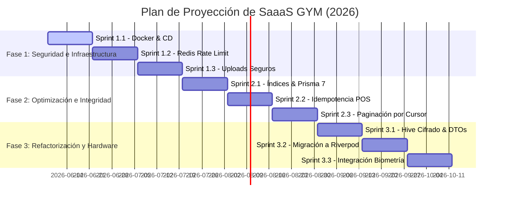

# Plan de Proyección Detallado: Fases, Sprints y Entregables (Código y Documentación) — SaaaS GYM

Este plan estratégico detalla el roadmap técnico de **SaaaS GYM**, segmentado en **3 fases consecutivas**, estructurado por **sprints de 2 semanas** (bajo metodología ágil) y especificando detalladamente los módulos afectados, las rutas exactas de los archivos involucrados (nuevos y por modificar) y los entregables correspondientes a **Código/Implementación** y a **Documentación**.

---

## 🗺️ Vista General del Roadmap (Mermaid)

---

## ⚙️ FASE 1: Seguridad Avanzada e Infraestructura de Producción (Sprints 1.1 al 1.3)

Esta fase se centra en consolidar el aislamiento de los contenedores Docker, establecer límites de seguridad a nivel API y proteger los datos cargados por usuarios externos.

### Sprint 1.1: Dockerización Segura, Segregación de Entornos y Optimización de RAM
*   **Duración**: 2 semanas.
*   **Módulos Afectados**: Infraestructura global, Scripts de despliegue.
*   **Objetivo**: Separar la configuración local de desarrollo del entorno productivo, limitando recursos (CPU/RAM), habilitando la sincronización en vivo y eliminando privilegios de root en contenedores.
*   **Archivos Modificados**:
    *   [docker-compose.yml](file:///d:/proyectos/sas_gym/docker-compose.yml): Redefinir para actuar como orquestación de desarrollo rápido con volúmenes locales de recarga rápida (`hot-reload`) y volúmenes anónimos para dependencias.
    *   [backend/Dockerfile](file:///d:/proyectos/sas_gym/backend/Dockerfile): Configurar como build multi-stage basado en `node:22-alpine` y usuario no-root.
*   **Archivos Nuevos**:
    *   `docker-compose.prod.yml`: Orquestador productivo que excluye volúmenes locales, fuerza límites de memoria física y arranca la API compilada con `node dist/main`.
    *   `backend/Dockerfile.prod`: Dockerfile optimizado para producción que instala únicamente dependencias productivas bajo `dependencies` y ejecuta Prisma Client.
*   **Entregables de Código e Implementación**:
    *   **Contenedor API de Producción**: Manifiesto `Dockerfile.prod` basado en Alpine con la directiva `USER node`.
    *   **Límites de RAM y CPU**: Configuración de `deploy.resources.limits` en docker-compose y la variable de entorno `NODE_OPTIONS=--max-old-space-size=768` para evitar fatiga del heap V8.
    *   **Volúmenes de Modificación Directa**: Configuración de enlaces locales (`bind mounts`) en el compose de desarrollo excluyendo `node_modules` mediante un volumen anónimo para aislar dependencias del contenedor de las del host.
*   **Entregables Documentales**:
    *   `docs/infra/guia-despliegue-docker.md`: Manual detallado sobre cómo iniciar servicios en desarrollo (`dev`) y producción (`prod`) usando los nuevos manifiestos.
    *   `docs/infra/checklist-seguridad-contenedores.md`: Reporte de auditoría interna validando que los contenedores no se ejecutan con privilegios de root.
    *   [buenas-practicas-docker-ram.md](file:///d:/proyectos/sas_gym/docs/infra/buenas-practicas-docker-ram.md): Guía detallada de optimización de memoria V8 y recarga en caliente (Hot-Reload) sin fatiga de watchers.

---

### Sprint 1.2: Rate Limiting Centralizado y Seguridad de Cabeceras
*   **Duración**: 2 semanas.
*   **Módulos Afectados**: `Auth`, Núcleo del Backend (`src/core/*`).
*   **Objetivo**: Implementar un limitador de peticiones distribuido utilizando Redis para soportar escalamiento horizontal, y forzar políticas estrictas de CORS y Helmet.
*   **Archivos Modificados**:
    *   [backend/src/main.ts](file:///d:/proyectos/sas_gym/backend/src/main.ts): Configurar Helmet e inyectar orígenes permitidos desde variables de entorno.
    *   [backend/src/core/config/env.ts](file:///d:/proyectos/sas_gym/backend/src/core/config/env.ts): Añadir validación para variables de Redis (`REDIS_URL`, `REDIS_PORT`).
    *   [backend/package.json](file:///d:/proyectos/sas_gym/backend/package.json): Incorporar dependencias de `@nestjs/throttler`, `ioredis` y `throttler-storage-redis`.
*   **Archivos Nuevos**:
    *   `backend/src/core/providers/redis-throttler.provider.ts`: Módulo de configuración para Throttler que conecta el almacenamiento a la base de datos Redis.
*   **Entregables de Código e Implementación**:
    *   **Configuración Global de Seguridad**: Activación de cabeceras HTTP de Helmet (XSS Protection, HSTS, CSP) en `main.ts`.
    *   **Throttler Provider**: Inyección de `RedisThrottlerProvider` en el módulo principal NestJS, restringiendo peticiones concurrentes por IP.
*   **Entregables Documentales**:
    *   `docs/security/politicas-cors-rate-limiting.md`: Especificación de límites (ej. 10 peticiones/min para endpoints `/auth/login` y `/auth/forgot-password`).

---

### Sprint 1.3: Carga de Archivos Segura (Uploads) y Validación de Magic Bytes
*   **Duración**: 2 weeks.
*   **Módulos Afectados**: `Payments` (Comprobantes), `Observations` (Incidencias).
*   **Objetivo**: Bloquear el acceso público directo a archivos subidos y garantizar que no se inyecten archivos ejecutables maliciosos disfrazados de imágenes.
*   **Archivos Modificados**:
    *   [backend/src/main.ts](file:///d:/proyectos/sas_gym/backend/src/main.ts): Remover la ruta estática pública `/uploads`.
    *   [backend/src/modules/payments/payments.controller.ts](file:///d:/proyectos/sas_gym/backend/src/modules/payments/payments.controller.ts): Modificar el controlador para requerir tokens JWT en la lectura/descarga de recibos.
    *   [backend/src/modules/observations/observations.controller.ts](file:///d:/proyectos/sas_gym/backend/src/modules/observations/observations.controller.ts): Restringir la consulta de archivos de incidencias por inquilino (`tenant_id`).
*   **Archivos Nuevos**:
    *   `backend/src/core/services/file-validator.service.ts`: Validador que lee los primeros bytes (firmas hexadecimales o *magic bytes*) del archivo para autenticar el tipo real de archivo (JPEG, PNG, PDF).
*   **Entregables de Código e Implementación**:
    *   **FileValidatorService**: Clase inyectable en NestJS que analiza flujos binarios de carga y bloquea la escritura en disco si el MIME declarado no coincide con los magic bytes (ej. `FF D8 FF` para JPEG).
    *   **Rutas de Descarga Autenticadas**: Endpoints en `payments.controller.ts` y `observations.controller.ts` que validan el token JWT del usuario solicitante y su pertenencia al `tenant_id` antes de servir el archivo mediante un Stream de Node.js.
*   **Entregables Documentales**:
    *   `docs/security/flujo-validacion-archivos.md`: Diagrama de secuencia del flujo desde la subida del miembro en Flutter hasta el almacenamiento en disco privado.

---

## 📈 FASE 2: Optimización e Integridad de Datos (Sprints 2.1 al 2.3)

Esta fase se enfoca en escalar la base de datos PostgreSQL, actualizar las tecnologías del ORM e implementar una lógica financiera a prueba de fallos de red.

### Sprint 2.1: Indexación Compuesta y Actualización a Prisma 7
*   **Duración**: 2 semanas.
*   **Módulos Afectados**: Persistencia de Datos.
*   **Objetivo**: Aumentar la velocidad de búsqueda de inquilinos y migrar el ORM Prisma a la versión 7, eliminando configuraciones deprecadas.
*   **Archivos Modificados**:
    *   [backend/prisma/schema.prisma](file:///d:/proyectos/sas_gym/backend/prisma/schema.prisma): Incorporar índices compuestos en las tablas críticas:
        *   `Announcement`: `@@index([tenant_id, activo])`
        *   `Membership`: `@@index([tenant_id, user_id, estado])`
        *   `Payment`: `@@index([tenant_id, created_at])`
    *   [backend/package.json](file:///d:/proyectos/sas_gym/backend/package.json): Actualizar dependencias de `prisma` y `@prisma/client` a la última versión estable `7.x`.
*   **Archivos Nuevos**:
    *   `backend/prisma.config.ts`: Nuevo formato de archivo de configuración que reemplaza los parámetros embebidos en el package.json.
*   **Entregables de Código e Implementación**:
    *   **Esquema Prisma Indexado**: Archivo `schema.prisma` compilado con índices compuestos B-Tree aplicados a columnas de búsqueda de tenant.
    *   **Migración SQL Generada**: Script de migración SQL en `/prisma/migrations/` autogenerado por Prisma CLI listo para producción.
*   **Entregables Documentales**:
    *   `docs/db/plan-migracion-prisma-7.md`: Registro de pruebas de regresión ejecutadas sobre el ORM actual versus la versión 7.
    *   `docs/db/analisis-indices-rendimiento.md`: Reporte del plan de ejecución (`EXPLAIN ANALYZE`) demostrando la ganancia de velocidad en consultas indexadas multi-inquilino.

---

### Sprint 2.2: Mecanismo de Idempotencia en Pagos y Ventas POS
*   **Duración**: 2 semanas.
*   **Módulos Afectados**: `Payments`, `Memberships`, API Client Móvil.
*   **Objetivo**: Garantizar que reintentos de red del cliente móvil durante una pasarela de pago o venta de membresías no generen transacciones dobles.
*   **Archivos Modificados**:
    *   [backend/src/modules/payments/payments.service.ts](file:///d:/proyectos/sas_gym/backend/src/modules/payments/payments.service.ts): Verificar que la cabecera `Idempotency-Key` no haya sido procesada previamente dentro del mismo tenant.
    *   [mobile_app/lib/core/network/api_client.dart](file:///d:/proyectos/sas_gym/mobile_app/lib/core/network/api_client.dart): Generar un UUID único para cada transacción de pago y anexarlo como header en peticiones POST.
*   **Archivos Nuevos**:
    *   `backend/src/core/interceptors/idempotency.interceptor.ts`: Interceptor global encargado de cachear temporalmente los payloads de respuestas exitosas basándose en la llave de idempotencia.
*   **Entregables de Código e Implementación**:
    *   **Idempotency Interceptor (Backend)**: Interceptor NestJS que utiliza Redis como almacén temporal de llaves de idempotencia con expiración automática (TTL 24h) para consultas duplicadas concurrentes.
    *   **UUID Header Generator (Flutter)**: Middleware HTTP en `api_client.dart` que inyecta automáticamente cabeceras `Idempotency-Key` para toda petición mutating (POST/PUT).
*   **Entregables Documentales**:
    *   `docs/architecture/politica-idempotencia.md`: Flujo del ciclo de vida de una transacción idempotente ante caídas del servidor y reconexiones automáticas del cliente.

---

### Sprint 2.3: Paginación Cursor-Based en Reportes y Auditorías
*   **Duración**: 2 semanas.
*   **Módulos Afectados**: `Reports` (Auditoría), `Members` (Búsqueda).
*   **Objetivo**: Reemplazar la paginación tradicional offset (que degrada el rendimiento de la base de datos a medida que se avanza en las páginas) por una paginación segura de alto rendimiento basada en cursores.
*   **Archivos Modificados**:
    *   [backend/src/modules/reports/reports.service.ts](file:///d:/proyectos/sas_gym/backend/src/modules/reports/reports.service.ts): Reescribir la query de logs de auditoría para ordenar por ID secuencial y tomar cursores temporales.
    *   [backend/src/modules/members/members.service.ts](file:///d:/proyectos/sas_gym/backend/src/modules/members/members.service.ts): Modificar el endpoint de búsqueda y reportes de asistencia para miembros.
*   **Entregables de Código e Implementación**:
    *   **Query Prisma Cursor**: Implementación técnica en `reports.service.ts` utilizando la cláusula `{ cursor: { id: cursorId }, skip: 1 }` de Prisma para búsquedas de auditorías de inquilinos.
    *   **Esquema de Respuesta Paginado**: Respuestas de API estructuradas que devuelven los campos `next_cursor` (UUID codificado en Base64) y `has_more` (booleano).
*   **Entregables Documentales**:
    *   `docs/db/estandar-paginacion-cursores.md`: Guía de implementación del estándar de paginación para desarrolladores de la API.

---

## 🎨 FASE 3: Refactorización Estructural de Clientes e Integraciones de Hardware (Sprints 3.1 al 3.3)

Esta fase rediseña la arquitectura interna del aplicativo Flutter y establece comunicación WebSocket en tiempo real con terminales biológicas y lectoras de huellas físicas.

### Sprint 3.1: Encriptación de Caché Hive y Desacoplamiento de Modelos de UI
*   **Duración**: 2 semanas.
*   **Módulos Afectados**: Persistencia Móvil, Modelos de Datos en Flutter.
*   **Objetivo**: Cifrar la información confidencial almacenada en los teléfonos inteligentes y separar los modelos puros de negocio de los estilos visuales de Material Design.
*   **Archivos Modificados**:
    *   [mobile_app/lib/main.dart](file:///d:/proyectos/sas_gym/mobile_app/lib/main.dart): Inicializar las cajas Hive utilizando claves criptográficas generadas de forma segura.
    *   [mobile_app/lib/core/services/sync_queue_service.dart](file:///d:/proyectos/sas_gym/mobile_app/lib/core/services/sync_queue_service.dart): Asegurar que los payloads locales de entrenamiento encolados en `sync_queue_box` utilicen almacenamiento cifrado.
    *   [mobile_app/pubspec.yaml](file:///d:/proyectos/sas_gym/mobile_app/pubspec.yaml): Agregar dependencias requeridas para cifrado Hive.
*   **Archivos Nuevos**:
    *   `mobile_app/lib/models/domain/*`: Directorio de DTOs y entidades puras Dart sin importación de dependencias visuales de Flutter (removiendo dependencias a `material.dart`).
*   **Entregables de Código e Implementación**:
    *   **Securización de Hive**: Cajas de persistencia inicializadas en `main.dart` mediante claves cifradas AES-256 generadas dinámicamente y recuperadas a través de la librería `flutter_secure_storage`.
    *   **Biblioteca de Modelos Desacoplada**: Archivos de datos independientes ubicados bajo `lib/models/domain/` sin referencias a Material UI (ej. reemplazo de clases de `Color` nativo por strings hex).
*   **Entregables Documentales**:
    *   `docs/mobile/esquema-cifrado-hive.md`: Explicación técnica de la obtención de la clave simétrica AES-256 desde *Flutter Secure Storage*.

---

### Sprint 3.2: Migración Arquitectónica a Riverpod
*   **Duración**: 2 semanas.
*   **Módulos Afectados**: Gestión de Estado en Flutter.
*   **Objetivo**: Eliminar la clase monolítica `GymState` para mitigar la sobrecarga de repintado de pantallas y mejorar la modularidad del código de la aplicación.
*   **Archivos Modificados**:
    *   [mobile_app/lib/main.dart](file:///d:/proyectos/sas_gym/mobile_app/lib/main.dart): Envolver el árbol de widgets de la aplicación dentro de un `ProviderScope`.
*   **Archivos Nuevos**:
    *   `mobile_app/lib/features/auth/providers/auth_provider.dart`: Gestión de sesiones de usuario e inicios de sesión.
    *   `mobile_app/lib/features/member/providers/member_provider.dart`: Estado de membresías, rutinas y puntos del socio.
    *   `mobile_app/lib/features/trainer/providers/trainer_provider.dart`: Creación de plantillas y reportes de volumen físico del coach.
    *   `mobile_app/lib/features/cashier/providers/cashier_provider.dart`: Turnos de caja y ventas.
*   **Entregables de Código e Implementación**:
    *   **Arquitectura Riverpod Implementada**: Reemplazo completo de `gym_state.dart` por múltiples providers independientes del paquete `flutter_riverpod` (ej. `StateNotifierProvider`).
    *   **UI Reactiva**: Modificación de las pantallas principales del miembro, entrenador y cajero para extender de `ConsumerStatefulWidget` o `ConsumerWidget`, leyendo solo los proveedores específicos del dominio visualizado.
*   **Entregables Documentales**:
    *   `docs/mobile/guia-riverpod-arquitectura.md`: Buenas prácticas de administración de estado, inyección de dependencias y pruebas unitarias de providers.

---

### Sprint 3.3: Conexión de Hardware Biométrico y Validación de Acceso
*   **Duración**: 2 semanas.
*   **Módulos Afectados**: `Attendance` (Asistencia), Gateway WebSockets.
*   **Objetivo**: Conectar los torniquetes físicos y lectores USB/Ethernet mediante eventos de Socket.io en el backend y notificar inmediatamente en las pantallas de acceso del administrador.
*   **Archivos Modificados**:
    *   [backend/src/core/gateways/saas.gateway.ts](file:///d:/proyectos/sas_gym/backend/src/core/gateways/saas.gateway.ts): Administrar suscripciones de dispositivos de hardware IoT autorizados mediante canales websocket privados.
    *   [backend/src/modules/attendance/attendance.service.ts](file:///d:/proyectos/sas_gym/backend/src/modules/attendance/attendance.service.ts): Disparar eventos websocket tras confirmaciones exitosas de biometría.
*   **Archivos Nuevos**:
    *   `backend/src/modules/attendance/dto/biometric-handshake.dto.ts`: Definición de esquema de datos transmitidos por el dispositivo físico de escaneo de huella.
*   **Entregables de Código e Implementación**:
    *   **Gateway WebSocket de Asistencia**: Socket.io event-handlers implementados en el `SaaSGateway` del backend para recibir tokens biométricos, realizar el handshake cifrado y emitir comandos de apertura de relé (`OPEN_GATE`).
    *   **DTO de Dispositivo Biométrico**: Validación formal de los datos entrantes (ID del dispositivo lector, huella digital serializada o hash de tarjeta, timestamp) utilizando `class-validator`.
*   **Entregables Documentales**:
    *   `docs/hardware/manual-integracion-biometrica.md`: Protocolo de conexión de dispositivos IoT y esquemas de carga útiles de Socket.io aceptados para la apertura de compuertas físicas.

---

## 📋 Resumen de Hitos y Entregables por Fase

| Fase | Sprints | Entregables de Código e Implementación | Entregables Documentales |
|---|---|---|---|
| **Fase 1** | Sprint 1.1 - 1.3 | docker-compose.prod.yml (multi-stage), Dockerfile.prod, redis-throttler.provider.ts, file-validator.service.ts (Magic Bytes), Rutas de descarga autenticadas JWT. | `docs/infra/guia-despliegue-docker.md`, `docs/security/politicas-cors-rate-limiting.md`, `docs/security/flujo-validacion-archivos.md` |
| **Fase 2** | Sprint 2.1 - 2.3 | schema.prisma (indexado con B-Trees), migrations SQL generadas, idempotency.interceptor.ts (con Redis), interceptores HTTP de idempotencia en Flutter, paginación cursor-based en reportes/miembros. | `docs/db/analisis-indices-rendimiento.md`, `docs/architecture/politica-idempotencia.md`, `docs/db/estandar-paginacion-cursores.md` |
| **Fase 3** | Sprint 3.1 - 3.3 | Hive cifrado en Flutter mediante llaves de Secure Storage, biblioteca de DTOs desacoplados, Providers Riverpod (Auth/Member/Trainer/Cashier), WebSocket handlers en NestJS y DTO de validación biométrica. | `docs/mobile/esquema-cifrado-hive.md`, `docs/mobile/guia-riverpod-arquitectura.md`, `docs/hardware/manual-integracion-biometrica.md` |
